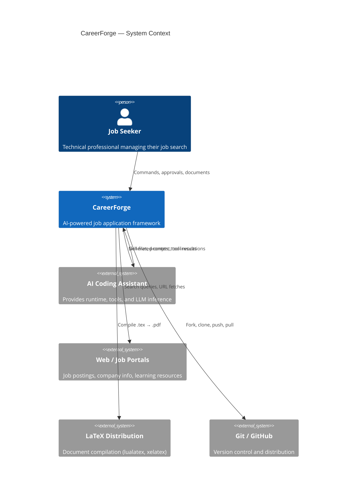
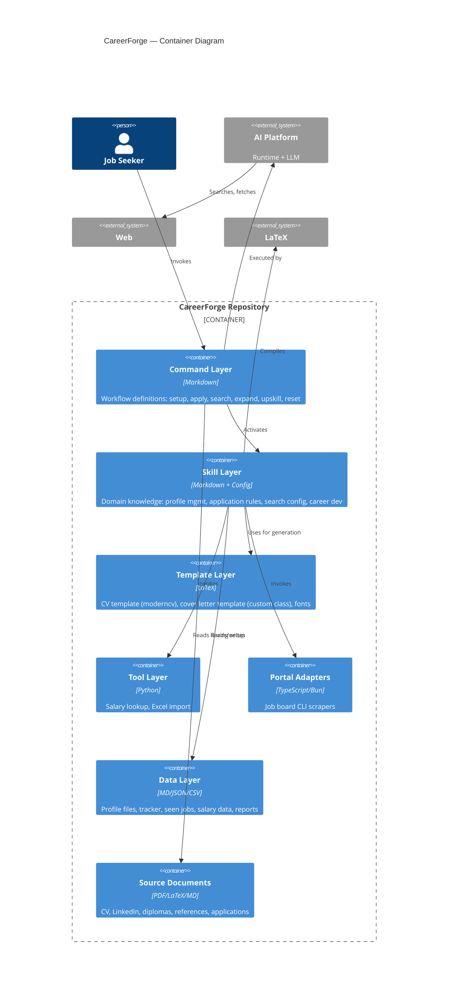
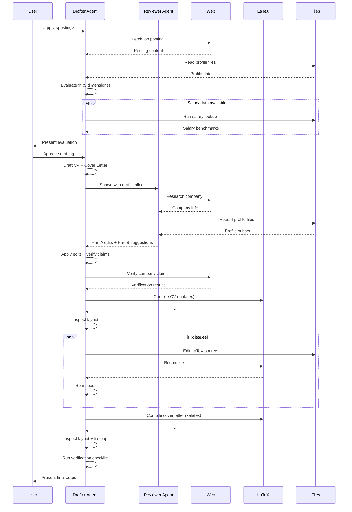

# Architecture Overview

> **Purpose:** Provides the high-level architectural view of CareerForge using C4-style context and container diagrams, and establishes the key architectural principles.
>
> **Status:** Draft
> **Last updated:** 2026-06-05
> **Owner persona:** Software Architect

---

## Architectural Style

CareerForge is a **prompt-driven AI orchestration framework**. Rather than being a traditional application with compiled code, it is a structured set of instructions, templates, and utility scripts that are interpreted by an AI coding assistant at runtime. The architecture resembles a domain-specific operating system built on top of the AI platform.

**Key characteristics:**
- **Declarative workflow definitions** — Commands are Markdown-based prompt files, not compiled code
- **Skill-based capability composition** — Capabilities are packaged as skill modules that the AI platform loads on demand
- **Agent-based parallelism** — Independent review tasks are delegated to sub-agents with isolated contexts
- **File-based state** — All persistent data lives in the filesystem as human-readable files
- **Local-first** — Everything runs on the user's machine; no server component

---

## System Context (C4 Level 1)



---

## Container Diagram (C4 Level 2)



---

## Component Overview (C4 Level 3 — Logical)

```mermaid
graph TB
    subgraph "Command Layer"
        CMD_SETUP["/setup"]
        CMD_APPLY["/apply"]
        CMD_SEARCH["/search"]
        CMD_EXPAND["/expand"]
        CMD_UPSKILL["/upskill"]
        CMD_RESET["/reset"]
    end
    
    subgraph "Skill Layer — Core"
        SK_PROFILE["Profile Manager<br/>(01-candidate, 02-behavioral)"]
        SK_WRITING["Writing Guide<br/>(03-writing-style)"]
        SK_EVAL["Evaluation Engine<br/>(04-job-evaluation)"]
        SK_CV["CV Generator<br/>(05-cv-templates)"]
        SK_CL["Cover Letter Generator<br/>(06-cover-letter-templates)"]
        SK_INTERVIEW["Interview Prep<br/>(07-interview-prep)"]
    end
    
    subgraph "Skill Layer — Search"
        SK_SCRAPER["Job Scraper Orchestrator"]
        SK_QUERIES["Search Queries Config"]
    end
    
    subgraph "Agent Layer"
        AG_DRAFTER["Drafter Agent<br/>(primary)"]
        AG_REVIEWER["Reviewer Agent<br/>(spawned per application)"]
        AG_RESEARCH["Research Agent<br/>(optional)"]
    end
    
    subgraph "Tool Layer"
        TL_SALARY["Salary Lookup (Python)"]
        TL_CONVERT["Excel Converter (Python)"]
    end
    
    subgraph "Data Layer"
        DL_PROFILE["Profile Files (7)"]
        DL_CLAUDE["CLAUDE.md"]
        DL_TRACKER["Tracker CSV"]
        DL_SEEN["Seen Jobs JSON"]
        DL_SALARY["Salary Data JSON"]
        DL_REPORTS["Upskill Reports"]
    end
    
    CMD_SETUP --> SK_PROFILE
    CMD_APPLY --> AG_DRAFTER
    CMD_SEARCH --> SK_SCRAPER
    CMD_EXPAND --> SK_PROFILE
    CMD_UPSKILL --> SK_EVAL
    CMD_RESET --> SK_PROFILE
    
    AG_DRAFTER --> SK_EVAL
    AG_DRAFTER --> SK_CV
    AG_DRAFTER --> SK_CL
    AG_DRAFTER --> AG_REVIEWER
    AG_DRAFTER --> TL_SALARY
    
    SK_SCRAPER --> SK_QUERIES
    SK_PROFILE --> DL_PROFILE
    SK_PROFILE --> DL_CLAUDE
    SK_EVAL --> DL_TRACKER
    SK_SCRAPER --> DL_SEEN
    TL_SALARY --> DL_SALARY
    CMD_UPSKILL --> DL_REPORTS
```



---

## Architectural Principles

### ARCH-0001: Prompt-as-Code
All workflow logic is expressed in natural-language prompt files (Markdown). No compiled application code defines the workflow. This makes the system:
- **Auditable** — Anyone can read what the system does
- **Modifiable** — Non-programmers can adjust behavior
- **Portable** — Can be adapted to different AI platforms by changing file format

### ARCH-0002: Skill Composition
Capabilities are modular skill files that the AI platform loads on demand. Skills can be:
- Combined (multiple skills active for one command)
- Swapped (replace a skill file to change behavior)
- Extended (add new skill files without modifying existing ones)

### ARCH-0003: Agent Isolation
When independent judgment is needed (e.g., reviewing drafts), work is delegated to a sub-agent with a fresh context. This prevents confirmation bias and ensures critique is genuinely independent.

### ARCH-0004: File-as-Database
All persistent state is stored in human-readable files (Markdown, JSON, CSV). This enables version control, manual editing, and transparency at the cost of query efficiency — an acceptable trade-off given the small data volumes.

### ARCH-0005: Graceful Degradation
Optional subsystems (salary benchmarking, portal adapters, document scanning) fail silently when unavailable. The core workflow (profile → apply → verify) always works.

### ARCH-0006: Human-in-the-Loop
Every consequential action requires explicit user approval. The system drafts; the user decides. Nothing is submitted, published, or permanently deleted without confirmation.

### ARCH-0007: No Fabrication
A hard architectural constraint: the system never generates claims not grounded in the user's profile data. This is enforced at every generation and verification step.

### ARCH-0008: Two-Plane Skill Architecture
Skills are split into two filesystem trees with different roles:
- **Plane 1 — Claude Code skills:** Markdown knowledge files at `.claude/skills/<name>/` loaded into the AI assistant's context on trigger keywords. They orchestrate prompts and instructions; they do not run code outside the assistant.
- **Plane 2 — Sub-agent skills:** Bun/TypeScript CLI tools at `.agents/skills/<name>/cli/` invoked as external commands. They have their own runtimes, dependencies, and lifecycles.

A skill is either Plane 1 or Plane 2, never both. The dashboard (REQ-5xxx) and portal adapters (ADR-0004) are Plane 2; profile management, job-application-assistant, job-scraper, and upskill are Plane 1. See DEC-013 for rationale.

### ARCH-0009: Named Sub-Agent Definitions
Top-level agents live as Markdown files at `.claude/agents/<agent-name>.md` with frontmatter declaring `name`, `description`, and optional `model`. The body is the agent's system prompt. The runtime loads these definitions when spawning the named agent. The `model:` field enables multi-model routing — e.g., a research agent can declare `model: gemini` to invoke a headless Gemini CLI rather than Claude. See DEC-015 for the multi-model rationale and REQ-6001 for the configurable-model contract.

### ARCH-0010: SKILL.md Frontmatter Orchestrator
Every skill on either plane is anchored by a `SKILL.md` file at the skill's root. The frontmatter is canonical:

```yaml
---
name: <kebab-case-skill-name>
description: <one-line summary; trigger keywords listed at the end of the line>
allowed-tools: <comma-separated tool list — Read, Edit, Bash, WebFetch, etc.>
---
```

The body names trigger phrases (for skills activated by keywords, including slash-prefixed names like `/scrape`), lists companion files (numbered `01-…`, `02-…` to encode reading order), and describes the skill's contract. Sub-agent skills on Plane 2 ALSO have a `cli/` subdirectory with `package.json` and TypeScript source. See DEC-014.

---

## Data Flow — Application Pipeline


