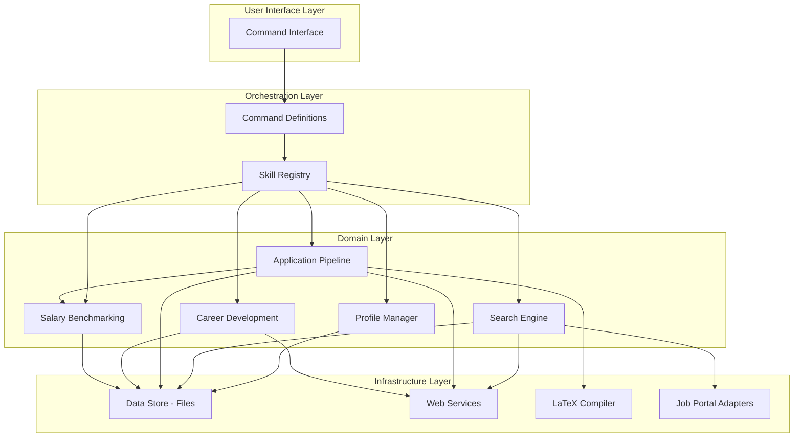
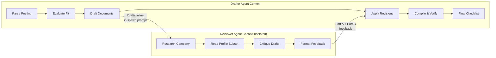

# Component Design

> **Purpose:** Details the major subsystems of CareerForge, their responsibilities, interfaces, and internal structure.
>
> **Status:** Draft
> **Last updated:** 2026-06-05
> **Owner persona:** Software Architect

---

## Component Map

---

## ARCH-0010: Profile Manager

**Responsibility:** Creates, reads, updates, and resets the seven profile files and the main context document (CLAUDE.md).

### Sub-Components

| Sub-Component | Responsibility | Triggered By |
|---------------|---------------|-------------|
| Document Scanner | Reads source documents, extracts structured data | /setup Path A |
| CV Importer | Parses single CV input, identifies gaps | /setup Path B |
| Interview Engine | Walks through 9-section questionnaire | /setup Path C |
| Cross-Reference Checker | Compares data across sources for inconsistencies | /setup Path A |
| Merge Engine | Classifies changes as additive/conflicting, writes files | /setup (all paths) |
| Competency Expander | Scans additional sources, web enrichment | /expand |
| Profile Resetter | Clears user data, preserves framework | /reset |

### Interfaces

**Inputs:**
- Source documents (PDF, LaTeX, Markdown) from `documents/` directory
- User responses to interview questions or follow-up prompts
- Existing profile file state (read before write)

**Outputs:**
- 7 populated skill files under `.claude/skills/job-application-assistant/`
- Main context document `CLAUDE.md`
- Search queries configuration

### Invariants
- **Idempotent:** Re-running with same inputs produces no new changes
- **Additive expansion:** /expand never modifies existing content
- **Framework preservation:** /reset preserves writing style guide, evaluation framework, template structure

---

## ARCH-0020: Search Engine

**Responsibility:** Discovers matching job postings across configured portals, deduplicates against history, and ranks by fit.

### Sub-Components

| Sub-Component | Responsibility |
|---------------|---------------|
| Query Executor | Runs search queries via web search or portal adapters |
| Result Parser | Extracts structured data from search results and fetched pages |
| Deduplication Engine | Checks results against seen_jobs.json and tracker CSV |
| Quick Fit Assessor | Classifies each job as High/Medium/Low match |
| State Manager | Persists new entries to seen_jobs.json |
| Results Presenter | Formats and displays ranked results table |

### Interfaces

**Inputs:**
- Search queries from configuration
- Seen jobs registry (JSON)
- Application tracker (CSV)
- User profile (for fit assessment)

**Outputs:**
- Ranked results table with fit levels
- Updated seen_jobs.json
- Handoff to Application Pipeline for selected jobs

### Key Design Decisions
- Pre-filter by title/snippet before expensive page fetches (token efficiency)
- Seen jobs registry grows monotonically (entries never removed)
- Quick fit is a 3-level classification, not the full 5-dimension evaluation

---

## ARCH-0030: Application Pipeline

**Responsibility:** The core value-producing workflow. Takes a job posting and produces verified, tailored CV and cover letter PDFs.

### Sub-Components

| Sub-Component | Responsibility | Step |
|---------------|---------------|------|
| Input Parser | Extracts company, role, language from posting | 0 |
| Evaluation Engine | 5-dimension scoring + salary benchmark | 1 |
| CV Generator | Produces tailored moderncv LaTeX document | 2 |
| Cover Letter Generator | Produces tailored cover letter LaTeX document | 2 |
| Reviewer Dispatcher | Spawns reviewer agent with drafts inline | 3 |
| Revision Engine | Applies structured edits + narrative suggestions | 4 |
| Compilation Verifier | Compiles PDFs, inspects layout, iterates fixes | 5 |
| Final Verifier | Runs one-time verification checklist | 6 |

### Agent Architecture

### Interfaces

**Inputs:**
- Job posting (URL or text)
- Profile files (7 skill files + CLAUDE.md)
- LaTeX templates (CV template, cover letter class + fonts)
- Salary data (optional)

**Outputs:**
- Fit evaluation table with verdict
- Tailored CV (.tex + .pdf)
- Tailored cover letter (.tex + .pdf)
- Verification checklist results
- Tailoring summary

### Critical Path Constraints
- User approval gate between evaluation and drafting
- Reviewer always spawned with fresh context (no drafter state leakage)
- Company claims always independently verified after reviewer suggestions
- PDF compilation and inspection never skipped
- Verification checklist runs exactly once, at the end

---

## ARCH-0040: Career Development

**Responsibility:** Helps users understand skill gaps, generate learning plans, and prepare for interviews.

### Sub-Components

| Sub-Component | Responsibility |
|---------------|---------------|
| Skill Differ | Extracts required skills from postings, diffs against profile |
| LLM Synthesizer | Identifies gaps that mechanical diffing misses |
| Gap Scorer | Assigns priority levels (Critical/High/Medium/Low) |
| Resource Finder | Searches web for learning resources per gap |
| Study Planner | Sequences learning with dependency awareness |
| Report Generator | Produces markdown reports with delta comparison |
| Interview Coach | Manages STAR examples, roleplay sessions |

### Interfaces

**Inputs:**
- Application tracker CSV (aggregate mode)
- Job posting URL (targeted mode)
- Profile files (current skills)
- Previous upskill reports (for delta)

**Outputs:**
- Gap heatmap table
- Learning plan with web-searched resources
- Study order with time estimates
- Markdown report (persisted)

---

## ARCH-0050: Salary Benchmarking

**Responsibility:** Looks up company salary data from user-provided benchmarks.

### Sub-Components

| Sub-Component | Responsibility |
|---------------|---------------|
| Data Loader | Reads salary_data.json |
| Fuzzy Matcher | Matches company names with variation handling |
| Formatter | Produces human-readable and JSON output |
| Excel Importer | Converts Excel spreadsheets to JSON format |

### Interfaces

**Inputs:**
- Company name (+ optional city filter)
- salary_data.json

**Outputs:**
- Matched company entries with salary indices
- Formatted table or JSON

### Key Design Decisions
- Standalone Python CLI tool (not integrated into AI platform directly)
- Fuzzy matching handles: legal suffixes, Nordic characters, anglicized spellings, parentheticals
- Data file is user-provided and gitignored
- Graceful failure when data file is absent
