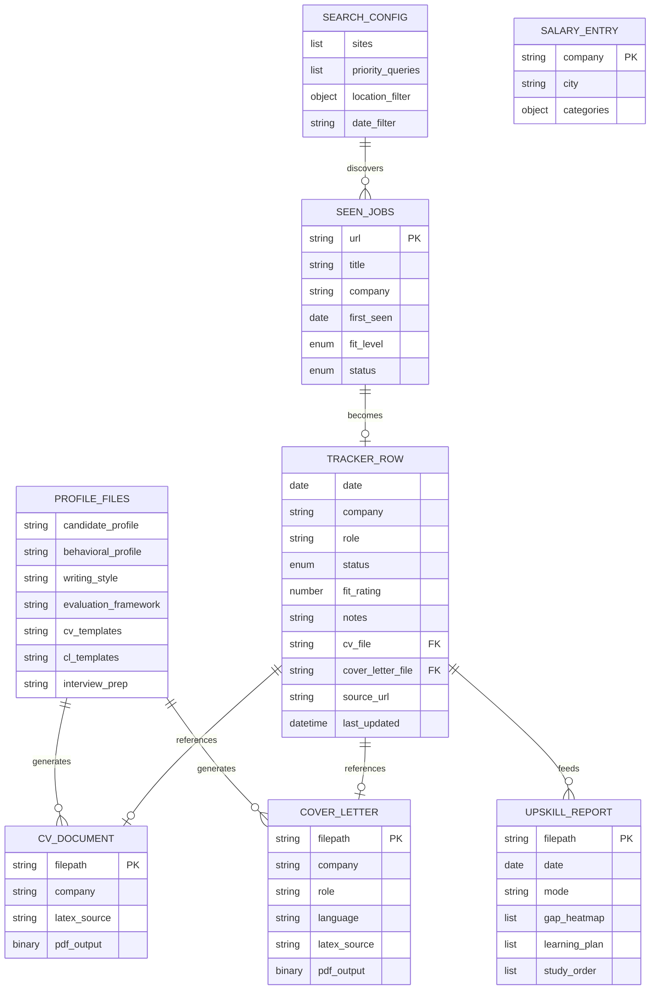

# Data Architecture

> **Purpose:** Specifies the physical data model, file schemas, relationships, and data lifecycle for CareerForge.
>
> **Status:** Draft
> **Last updated:** 2026-06-05
> **Owner persona:** Software Architect
> **Satisfies:** [Data Requirements](../requirements/data-requirements.md)

---

## Storage Strategy

All data is stored as flat files in the repository directory. No database. No external storage.

| Format | Files | Access Pattern |
|--------|-------|---------------|
| Markdown | Profile files, CLAUDE.md, reports, READMEs | Read/write by AI agent; human-editable |
| JSON | `job_scraper/seen_jobs.json`, `salary_data.json` | Read/write by tools; structured queries |
| CSV | job_search_tracker.csv | Append-mostly; read for aggregation |
| LaTeX | CV/cover letter templates, generated documents | Write-then-compile; human-reviewable |
| PDF | Compiled documents | Output-only; visually inspected |

### File System Layout

```
<repo-root>/
├── CLAUDE.md                          # Main context (generated)
├── .claude/
│   ├── commands/
│   │   ├── setup.md                   # Onboarding command
│   │   ├── apply.md                   # Application command
│   │   ├── expand.md                  # Expansion command
│   │   └── reset.md                   # Reset command
│   ├── skills/
│   │   ├── job-application-assistant/
│   │   │   ├── SKILL.md               # Skill definition + orchestration
│   │   │   ├── 01-candidate-profile.md
│   │   │   ├── 02-behavioral-profile.md
│   │   │   ├── 03-writing-style.md
│   │   │   ├── 04-job-evaluation.md
│   │   │   ├── 05-cv-templates.md
│   │   │   ├── 06-cover-letter-templates.md
│   │   │   └── 07-interview-prep.md
│   │   └── job-scraper/
│   │       ├── SKILL.md
│   │       └── search-queries.md
│   ├── agents/
│   │   └── research-agent.md
│   └── settings.local.json
├── cv/
│   ├── main_example.tex               # Master CV template
│   └── main_<company>.tex             # Generated (gitignored)
├── cover_letters/
│   ├── cover.cls                      # Custom LaTeX class
│   ├── OpenFonts/fonts/               # Bundled fonts
│   └── cover_<company>_<role>.tex     # Generated (gitignored)
├── documents/
│   ├── README.md
│   ├── cv/                            # User's source CVs
│   ├── linkedin/                      # LinkedIn export
│   ├── diplomas/                      # Degree certificates
│   ├── references/                    # Reference letters
│   └── applications/<company>_<role>/ # Past applications
├── tools/
│   ├── README_SALARY_TOOL.md
│   └── convert_salary_excel.py
├── upskill/                           # Generated reports
├── salary_lookup.py
├── salary_data.json                   # User-provided (gitignored)
├── job_search_tracker.csv             # Application tracker
└── job_scraper/
    └── seen_jobs.json                 # Search state
```

---

## Entity Relationship Diagram



---

## Data Lifecycle

### Profile Files
```
Created: /setup (one-time) or /reset → /setup (re-create)
Updated: /expand (additive), /setup --section (partial)
Reset: /reset profile (blanked with preserved structure)
Never modified by: /apply, /search, /upskill
```

### Seen Jobs Registry
```
Created: First /search (empty object if file missing)
Updated: Every /search (new entries appended)
Never shrunk: Entries are never removed
```

### Application Tracker
```
Created: Repository initialization (header row only)
Updated: /apply (new row when user decides to apply)
Read by: /upskill aggregate mode, /search deduplication
```

### Generated Documents
```
Created: /apply step 2 (LaTeX) + step 5 (PDF)
Never updated: Each application creates new files
Gitignored: Personal application output
```

---

## Consistency Rules

1. **Read-before-write:** Profile files are always read before modification to prevent clobbering concurrent edits
2. **Append-only CSV (system writes):** Tracker rows are appended by `/apply`; the application pipeline never modifies existing rows.
3. **Bounded in-place edits (dashboard writes):** The tracking dashboard (REQ-5xxx) may modify only the `status`, `notes`, and `last_updated` columns of existing rows. All other columns are immutable from the UI. Writes must be atomic: write to a tempfile, fsync, rename — to prevent corruption if `/apply` appends concurrently.
4. **Monotonic registry:** Seen jobs entries are only added, never removed or updated.
5. **Source annotations:** Expanded competencies include source annotations that serve as deduplication keys.
6. **No cross-file transactions:** Each file is independently consistent; there are no multi-file atomic operations.
