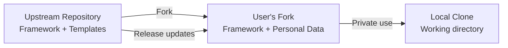

# Deployment & Infrastructure

> **Purpose:** Documents the distribution model, installation process, and update strategy for CareerForge.
>
> **Status:** Draft
> **Last updated:** 2026-06-05
> **Owner persona:** Software Architect

---

## Distribution Model

CareerForge uses a **fork-and-customize** model:



### Upstream Repository
Contains framework files only:
- Command definitions
- Skill files (with placeholder tokens)
- LaTeX templates and fonts
- Utility scripts
- Documentation
- .gitignore

Does **not** contain:
- Any personal data
- Populated profile files
- Salary data
- Generated documents

### User's Fork
Contains everything from upstream plus:
- Populated profile files (committed to private fork)
- Source documents (gitignored)
- Generated documents (gitignored)
- State files (gitignored)

### Update Strategy
```bash
# Add upstream as remote (once)
git remote add upstream <upstream-url>

# Pull framework updates
git fetch upstream
git merge upstream/main
```

Framework updates (command logic, template fixes, skill rules) merge cleanly because user-specific data lives in separate files or gitignored locations. The only potential merge conflicts are in profile files if the framework changes their structure.

---

## Installation

### Prerequisites

| Tool | Version | Required? | Install |
|------|---------|-----------|---------|
| AI coding assistant | Latest | Yes | `npm install -g ...` |
| Python | 3.10+ | For salary tools | System package manager |
| LaTeX | Full distribution | Yes | TeX Live / MacTeX / MiKTeX |
| Bun | Latest | For portal adapters | `curl -fsSL https://bun.sh/install \| bash` |
| Git | Any | Recommended | System package manager |

### Setup Steps

```bash
# 1. Fork and clone
gh repo fork <upstream>/careerforge --clone
cd careerforge

# 2. Install portal adapter dependencies
for tool in <adapter-directories>; do
  cd .agents/skills/$tool/cli && bun install && cd ../../../..
done

# 3. Optional: Install salary Excel converter dependency
pip install openpyxl

# 4. Start AI assistant and run onboarding
claude  # or equivalent AI assistant CLI
# Then: /setup
```

---

## Infrastructure Requirements

### Local Machine
- **Storage:** ~50 MB for framework + fonts; grows with documents and generated files
- **RAM:** Standard for AI assistant CLI + LaTeX compilation
- **Network:** Required for web search, job fetching, company research; not for compilation or profile management

### No Server Component
- No backend services
- No databases
- No cloud infrastructure
- No API keys beyond the AI platform subscription
- Everything runs locally

---

## Environments

| Environment | Purpose | Description |
|-------------|---------|-------------|
| Development | Working on framework | The upstream repository |
| User | Active job search | User's forked repository |
| Test | Verifying changes | Branch of development or user repo |

There is no staging, production, or CI/CD pipeline in the traditional sense. The "deployment" is forking the repository.
