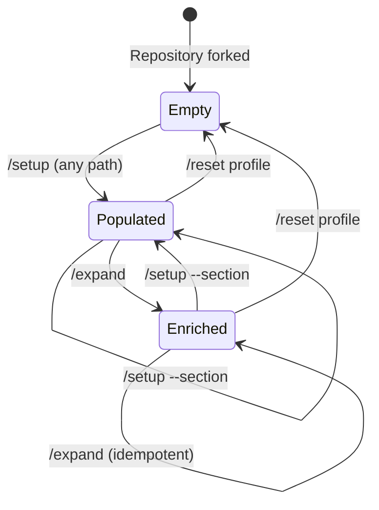
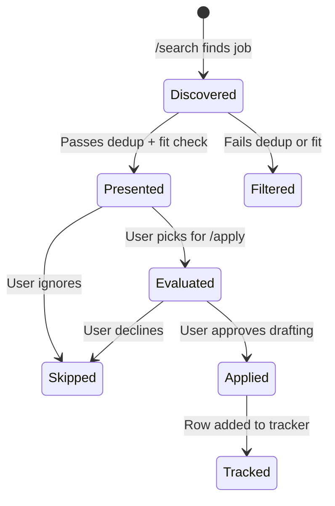

# State Management

> **Purpose:** Documents all mutable state in CareerForge, how it is persisted, and consistency guarantees.
>
> **Status:** Draft
> **Last updated:** 2026-06-05
> **Owner persona:** Software Architect

---

## State Categories

| State | File | Mutated By | Read By | Pattern |
|-------|------|-----------|---------|---------|
| Candidate Profile | 01-candidate-profile.md | /setup, /expand | /apply, /upskill, /expand | Read-modify-write |
| Behavioral Profile | 02-behavioral-profile.md | /setup, /expand | /apply (reviewer) | Read-modify-write |
| Writing Style | 03-writing-style.md | /setup (patterns only) | /apply | Read-only (framework) |
| Evaluation Framework | 04-job-evaluation.md | /setup | /apply, /upskill | Read-only (post-setup) |
| CV Templates | 05-cv-templates.md | /setup (profiles only) | /apply | Mixed (framework + user data) |
| CL Templates | 06-cover-letter-templates.md | Never | /apply | Read-only (framework) |
| Interview Prep | 07-interview-prep.md | /setup | User (manual) | Mixed (framework + user data) |
| Main Context | CLAUDE.md | /setup | All commands | Regenerated per setup |
| Search Queries | search-queries.md | /setup | /search | Regenerated per setup |
| Seen Jobs | seen_jobs.json | /search | /search | Append-only |
| Tracker | job_search_tracker.csv | /apply | /search, /upskill | Append-only |
| Salary Data | salary_data.json | User (manual/import) | /apply | Read-only |
| Upskill Reports | upskill/*.md | /upskill | /upskill (delta) | Write-once |
| Generated CVs | cv/main_*.tex | /apply | User | Write-once |
| Generated CLs | cover_letters/cover_*.tex | /apply | User | Write-once |

---

## Consistency Model

### Single-Writer Guarantee
Only one command runs at a time (the AI assistant processes one command per invocation). There are no concurrent writers, so file-level consistency is inherently guaranteed.

### Read-Before-Write Protocol
All profile-modifying commands read the current state of target files before proposing changes. This ensures:
- No blind overwrites
- Changes are classified as additive vs. conflicting
- The user sees what will change before it happens

### Append-Only Stores
Two data stores use append-only semantics:
- **seen_jobs.json**: New entries added; existing entries never modified or removed
- **job_search_tracker.csv**: New rows appended; existing rows never modified by the system

### Idempotency Keys
- **Profile files:** Content deduplication (exact string matching)
- **Expanded competencies:** Source annotations serve as idempotency keys (e.g., *(Coursera — Deep Learning)*)
- **Seen jobs:** URL is the primary key; company+title is the secondary key

---

## State Transitions

### Profile State Machine

### Job State Machine

---

## Failure Recovery

| Failure | State Impact | Recovery |
|---------|-------------|----------|
| Setup interrupted mid-write | Partial profile files | Re-run /setup; read-before-write detects existing content |
| Apply interrupted during drafting | Partial .tex files | Re-run /apply; files are overwritten per-company |
| Apply interrupted during compilation | .tex exists, no .pdf | Manually run lualatex/xelatex, or re-run /apply |
| Search interrupted | Partial seen_jobs update | Re-run /search; dedup handles any already-added entries |
| Salary data corrupted | Lookup fails | Tool exits with error; salary step skipped |
