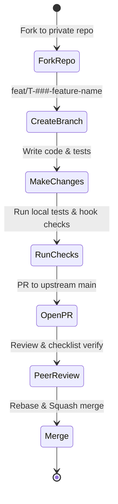

# Development — Contribution Workflow

> **Purpose:** Outlines the contribution pipeline, branch restrictions, PR procedures, and manual/automated quality gates for developers.
>
> **Status:** Draft
> **Last updated:** 2026-06-05
> **Owner persona:** Staff Engineer

---

## Workflow Overview



---

## 1. Forking & Local Setup

1. **Fork to a Private Repository**: Because your personal profiles contain sensitive PII, always fork the project into a private repository. Keep your upstream remote pointing to the open-source main repository.
   ```bash
   git remote add upstream https://github.com/your-org/careerforge.git
   ```
2. **Pre-Commit Verification**: Run the bootstrap task to install local hooks:
   ```bash
   ./tools/bootstrap.sh
   ```
   *The pre-commit hook checks that:*
   - No files containing secrets or keys are staged.
   - Personal profile data (the populated user-fork `CLAUDE.md`, `documents/` contents) and generated PDFs in output folders are excluded from staging.
   - Code passes formatting and lint validation.

---

## 2. Branching Guidelines

- Always base feature branches on `upstream/main`.
- Name your branch according to the task type and ID:
  - New Features: `feat/T-###-feature-name` (e.g. `feat/T-072-job-search-cli`)
  - Bug Fixes: `fix/T-###-bug-name` (e.g. `fix/T-044-cv-overflow`)
  - Docs Updates: `docs/doc-topic`

---

## 3. Local Validations

Before submitting a Pull Request, run the following test commands locally:

```bash
# Run typescript compilation and formatting check
npm run lint

# Run python black/ruff checks
python -m black --check tools/

# Run unit tests
npm test
```

---

## 4. Pull Request Standards

When opening a Pull Request against the upstream repository:

### PR Description Template
- **Requirement Addressed**: Link to the specific requirement (e.g. `REQ-1004` Job Deduplication).
- **Description**: What change does this PR introduce? Detail the logic used.
- **Verification Performed**:
  - Summarize automated test additions.
  - Describe manual execution runs.
  - **REQUIRED**: Attach screenshots or snippets of the terminal logs demonstrating successful command runs (e.g., compile checks).

### CI Quality Gates
The Pull Request must pass the automated GitHub Action runner:
1. **Linter & Typecheck**: Node/Bun linting and TSC check must compile with zero errors.
2. **Unit Test Suite**: 100% of defined tests must pass.
3. **Traceability Verification**: The commit message and description must list at least one valid `REQ-` or `ARCH-` ID.

---

## 5. Peer Review & Merge

- **Approval Gates**: At least one maintainer or peer must approve the PR.
- **Reviewer Checklist**:
  - Verify that the code uses clean-room patterns.
  - Check that the LaTeX escaper handles special characters introduced in this branch.
  - Double-check that no PII or secret files are present in the commit diff.
- **Merging**: Merge using "Squash and Merge" to keep the commit tree simple and clean.
