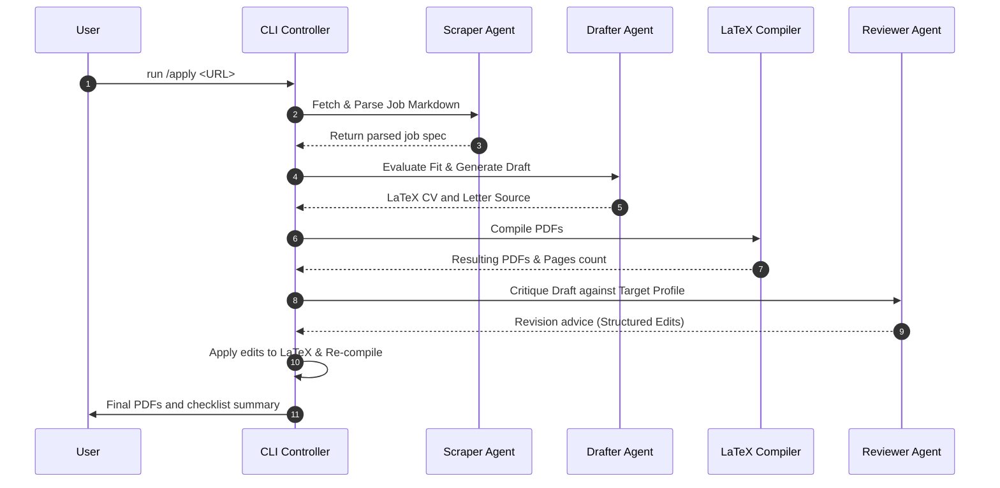

# Development — Implementation Guide: Application Pipeline

> **Purpose:** Technical guidelines for implementing the `/apply` command and the two-agent drafter-reviewer compilation loop.
>
> **Status:** Draft
> **Last updated:** 2026-06-05
> **Owner persona:** Staff Engineer

---

## 1. Pipeline Execution Flow

The `/apply <URL>` command orchestrates six consecutive steps to produce a verified, professional job application.



---

## 2. Implementation Specifications

### Step 0: Scrape & Parse Job Description
- **Target**: Scrape content from the target URL using `tools/adapters/` modules.
- **Handling JavaScript**: Use a headless fetcher or a generic markdown extraction fallback.
- **Output**: A parsed job spec JSON containing `Title`, `Company`, `Required_Skills`, `Desired_Background`, and `Parsed_Description`.

### Step 1: Fit Assessment (5-Dimensional Scoring)
- **Engine**: Evaluate compatibility using the rules in `04-job-evaluation.md`.
- **Dimensions**:
  1. *Hard Skills Match* (0–100%)
  2. *Experience Level Match* (0–100%)
  3. *Cultural Alignment* (0–100%)
  4. *Domain Familiarity* (0–100%)
  5. *Salary vs Benchmarking* (0–100% based on `salary_lookup.py` data)
- **Output**: Persist scores and summary log inside `job_search_tracker.csv` (at repo root).

### Step 2: Generation & LaTeX Sanitization
- **Source Generation**: Construct CV and cover letter source using profile values and the target job spec.
- **Sanitizer**: Run the LaTeX escaper script (defined in [Coding Standards](coding-standards.md)) over all dynamic user texts before rendering templates to prevent command injection or compilation breaks.

### Step 3: Compilation Loop
- **Executors**:
  - Run `lualatex --interaction=nonstopmode --output-directory=cv/output/ cv/output/draft.tex`
  - Run `xelatex --interaction=nonstopmode --output-directory=cover_letters/output/ cover_letters/output/draft.tex`
- **Output Audit**: Parse the compilation log file (`.log`). If a page limit is exceeded (e.g., cover letter is 2 pages), trigger the content-cutting subroutine to truncate bullet points and re-compile.

### Step 4: Reviewer Loop (Revision Engine)
- **Critique Format**: The Reviewer Agent generates feedback in two sections:
  - **Part A (Structured Edits)**: Exact substring searches and replacements to correct typos, align dates, or adjust formatting.
    ```json
    [
      {
        "search": "\\item{Senior Developer at Acme Corp}",
        "replace": "\\item{Staff Engineer at Acme Corp}"
      }
    ]
    ```
  - **Part B (Suggestions)**: Narrative improvement recommendations for formatting, flow, and tone.
- **Engine**: The CLI runner loops through Part A edits, executes string substitutions on the `.tex` files, and runs Step 3 again to re-compile. Limit to a maximum of 2 iterations.

---

## 3. Error Handling

- **LaTeX Compile Failure**: If a compile fails with exit code `!= 0`, output the last 15 lines of the LaTeX log file to the console and halt the process. Do not write dummy files.
- **API Call Failure**: Gracefully abort the pipeline, keeping the current `.tex` draft intact so developers can manually compile what has already been generated.
