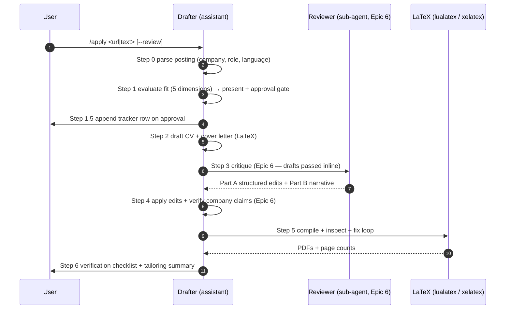

# Development — Implementation Guide: Application Pipeline

> **Purpose:** Technical guidelines for implementing the `/apply` command and the two-agent drafter-reviewer compilation loop.
>
> **Status:** Draft
> **Last updated:** 2026-06-07
> **Owner persona:** Staff Engineer

---

## 0. Architecture Note — Prompt-as-Code

`/apply` is a Markdown command at `.claude/commands/apply.md` executed by the
Claude Code assistant (ARCH-0001), not a compiled CLI. The "drafter" and
"reviewer" are the assistant and a spawned sub-agent (ARCH-0003), not server
processes. Profile and job data live in files (file-as-DB, ARCH-0004); there is
no `settings/profile.json` and no intermediate `*/output/draft.tex`.

---

## 1. Pipeline Execution Flow

The `/apply <url|text>` command runs six steps to produce a verified application.
Epic 5 implements Steps 0–2 + 5–6; the reviewer (Steps 3–4) lands in Epic 6.

---

## 2. Implementation Specifications

### Step 0: Parse the posting (REQ-2001, REQ-2002)
- **Input:** a URL (fetched) **or** pasted text — equal-priority modes; paste is
  not a fallback. Extract company, role, department, location, posting language.
- **Language:** cover letter follows the posting language; the CV is always
  English.

### Step 1: Fit evaluation (REQ-2010–2013)
Score with the framework in `04-job-evaluation.md`. The **five dimensions** are:
1. Technical Skills Match (0–100, weight 30%)
2. Experience Match (0–100, weight 25%)
3. Behavioral/Culture Fit (0–100, weight 15%)
4. Career Alignment (0–100, weight 30%)
5. Location & Logistics (Pass/Fail, not weighted; FAIL → verdict Poor Fit)

**Salary is not a scoring dimension.** Salary benchmarking is a separate
Could-priority integration (REQ-2011): call `salary_lookup.py` and show the index
as context; skip silently if unavailable. Present the evaluation table + verdict,
then stop at the approval gate (REQ-2013).

### Step 1.5: Record the application (data-req §11)
On approval, append one row to `job_search_tracker.csv` (status `drafting`, fit
rating from Step 1, planned output paths). Existing rows are never mutated.

### Step 2: Drafting (REQ-2020–2024)
- **CV:** copy `cv/main_example.tex` → `cv/main_<company>.tex`; tailor with the
  `cfcv.cls` macros; compile target 2 pages.
- **Cover letter:** copy `cover_letters/main_example.tex` →
  `cover_letters/cover_<company>_<role>.tex`; compile target 1 page.
- Escape dynamic user text for LaTeX (see [Coding Standards](coding-standards.md))
  to avoid command injection or compile breaks.
- Enforce writing-quality rules (business-rules §4); never fabricate (ARCH-0007).

### Step 3–4: Reviewer loop (Epic 6 — T-050–T-055)
The reviewer sub-agent returns feedback in two parts:
- **Part A (Structured Edits):** a JSON array of
  `{ "file": string, "old_string": string, "new_string": string, "reason": string }`
  objects; `old_string` must be exact and unique within the file (REQ-2032).
- **Part B (Narrative Suggestions):** prose grouped by category, every category
  addressed.

The drafter applies Part A edits, addresses Part B with judgment, and
**independently verifies every incorporated company claim** via web search
(REQ-2042) before re-compiling.

### Step 5: Compile & inspect (REQ-2050–2055)
- **CV:** `lualatex main_<company>.tex` from `cv/`.
- **Cover letter:** `xelatex cover_<company>_<role>.tex` from `cover_letters/`
  (working dir matters for font resolution).
- Inspect page counts and layout; run the iterative fix loop, consulting the
  layout-fix memory cache at `.agents/state/layout-fixes.json` before each
  model-derived fix (REQ-2053/2055). Genuine overflow → relevance-weighted
  cutting (business-rules §2.2), never margin/spacing reduction.
- Clean up auxiliary files, keeping only `.tex` and `.pdf` (REQ-2054).

### Step 6: Verify & present (REQ-2060–2062)
Run the verification checklist exactly once (business-rules §5), summarize 3–5
tailoring decisions, and list the output files.

---

## 3. Error Handling

- **LaTeX compile failure:** read the LaTeX `.log`, surface the relevant error
  lines, fix the source, and recompile until clean (REQ-2050). Do not write dummy
  files or present an uncompiled draft as final.
- **Web fetch / search failure:** for the posting URL, ask the user to paste the
  text instead (equal-priority input). For salary lookup, degrade gracefully and
  note "Salary data not available". Keep generated `.tex` drafts intact so the
  user can compile manually if the pipeline aborts.
