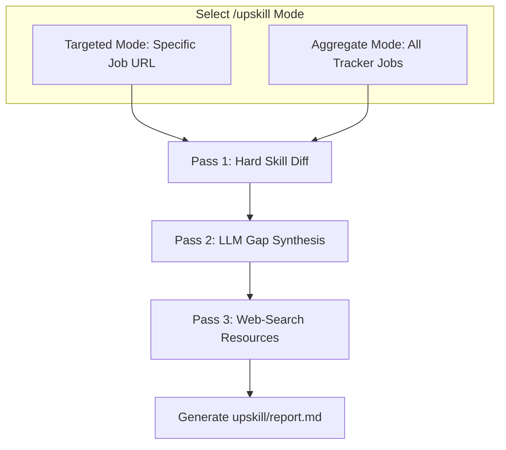

# Development — Implementation Guide: Career Advisor & Prep

> **Purpose:** Detailed implementation guide for profile competency expansion, skill gap analysis, and STAR-based interview preparation.
>
> **Status:** Draft
> **Last updated:** 2026-06-05
> **Owner persona:** Staff Engineer

---

## 1. Profile Expansion Engine (`/expand`)

The `/expand` command enriches the existing candidate profile with online context (GitHub portfolios, personal sites) and custom text files.

### Execution Loop
1. **Source Scanning**: Fetch public HTML or JSON API responses for user-configured endpoints (e.g. GitHub repos, public portfolios).
2. **LLM Extraction**: Send fetched text and the current profile to the LLM. Instruct the model to identify:
   - Specific libraries, tools, or frameworks not documented in `settings/profile.json`.
   - Projects and architectural patterns described in public code/repositories.
3. **Traceability Annotations**: When writing new elements into the profile, include source attribution tags:
   ```json
   {
     "skill": "Docker",
     "source": "GitHub repository my-app-deploy"
   }
   ```

---

## 2. Skill Gap Analysis (`/upskill`)

The `/upskill` command operates in two modes: **Aggregate Mode** and **Targeted Mode**.



### Analysis Pipeline
- **Pass 1: Hard Skill Diff**: Perform an exact-match list intersection between candidate skills and job requirements.
- **Pass 2: LLM Synthesis**: Feed missing skills and project descriptions to the LLM to identify higher-level architectural gaps (e.g. "Candidate has Docker experience but lacks Kubernetes orchestrations required for large scale deployments").
- **Pass 3: Resource Lookup**: Use a web search tool to find relevant online tutorials, courses, and documentation for missing skills.
- **Output**: Persist a styled Markdown report in `upskill/reports/` containing a gap heatmap, study sequence plan, and direct links to learning resources.

---

## 3. STAR Interview Preparation

The interview preparation sub-module generates a interactive roleplay environment based on the candidate's profile and a target job.

### Generation Rules
1. **Scenario Matching**: Create 5 customized behavioral questions matching requirements in `07-interview-prep.md` (focused on leadership, failure, complexity, conflict, and impact).
2. **Roleplay Prompting**: Initiate a console chat session where the LLM plays the hiring manager.
3. **STAR Validation**: When the user provides an answer, the validator checks for the following components:
   - **S**ituation (context and scale)
   - **T**ask (specific challenge)
   - **A**ction (what *the candidate* did, avoiding "we")
   - **R**esponse / Result (measurable metrics and impact)
4. **Critique Report**: At the end of the session, generate a scorecard outlining details that were too vague or lacked quantifiable metrics.
