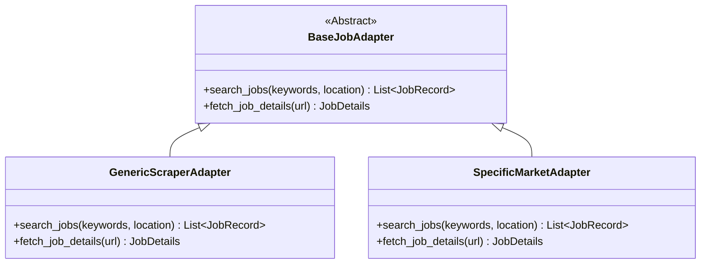

# Development — Implementation Guide: Job Search Engine

> **Purpose:** Detailed implementation guide for the job search engine, adapter pattern, scraping mechanisms, and deduplication logic.
>
> **Status:** Draft
> **Last updated:** 2026-06-05
> **Owner persona:** Staff Engineer

---

## 1. Pluggable Adapter Pattern

The search engine separates search orchestration from site-specific markup parsing using a pluggable adapter pattern.



All portal adapters must inherit from `BaseJobAdapter` and implement its abstract methods. This architecture allows developers to add adapters for specific job boards (e.g. LinkedIn, Indeed, or national portals) without modifying the search command orchestration code.

---

## 2. Scraping Mechanisms

### Headless Fetching
- Scrapers read target URLs using a standard client module (`tools/adapters/generic_scraper.ts`).
- If a target page requires client-side rendering (SPA), the scraper falls back to a browser simulator or fetches a text fallback.
- Read contents are cleaned: remove scripts, stylesheets, and irrelevant footers, then format the remaining content into readable Markdown before parsing.

### Target Parsing
- Scrapers use metadata selectors or LLM-driven token extraction to parse critical fields (e.g. Job Title, Company Name, Location, Description, Date Posted).

---

## 3. Deduplication Strategy (`seen_jobs.json`)

To prevent the scraper from displaying identical jobs across multiple runs:

1. **State Store**: Maintain a local JSON lookup table at `job_scraper/seen_jobs.json`.
2. **Identification Hash**:
   - Construct a unique hash for each job posting using: `MD5(Job_Title + Company_Name + URL)`.
3. **Execution Filter**:
   - During `/search`, compare discovered jobs against the keys in `seen_jobs.json`.
   - Filter out matching entries from the output.
   - For new applications generated via `/apply`, add the job hash to `seen_jobs.json` to prevent it from showing up in subsequent search listings.

---

## 4. Job Evaluation & Ranking

Discovered jobs are scored using a quick-fit heuristics parser:

```
Score = (Keyword_Match * 0.4) + (Profile_Similarity * 0.4) + (Location_Fit * 0.2)
```

- **High Fit**: Score $\ge$ 80%
- **Medium Fit**: Score $\ge$ 50% and < 80%
- **Low Fit**: Score < 50%

Results are displayed in a clean console table sorted by Fit Level (descending order).

---

## 5. Application Tracker Log

When the user decides to apply to a job, the system appends a new row to `job_search_tracker.csv` (at the repo root). The canonical schema is defined in `docs/requirements/data-requirements.md §11`.

### CSV Columns (canonical)

```
date, company, sector, role, role_type, channel, status, contact_person,
fit_rating, notes, cv_file, cover_letter_file, source, last_updated
```

- **date**: ISO-8601 date the row was created (e.g., `2026-06-05`)
- **status**: One of the Application Status Enum values: `Draft`, `Sent`, `Interview`, `Offer`, `Rejected`, `Withdrawn`, `Closed` — see `business-rules-and-validation.md §9`
- **cv_file / cover_letter_file**: Relative paths to the generated PDF files
- **last_updated**: Updated automatically whenever a field is changed (by `/apply` on creation; by the tracking dashboard on subsequent edits)

### Write discipline

- `/apply` **appends only** — never mutates existing rows
- The tracking dashboard mutates only `status`, `notes`, and `last_updated`
- All writes are atomic (tempfile + fsync + rename) per NFR-0016

### Implementation note

Do **not** use the old schema (`Date,Company,Title,URL,FitScore,Status,CV_Path,CL_Path`) or status enum (`Generated`, `Applied`, `Interviewing`, `Rejected`, `Offered`). Those were pre-spec definitions superseded by the canonical schema above. Any existing implementation using the old schema must be migrated.
