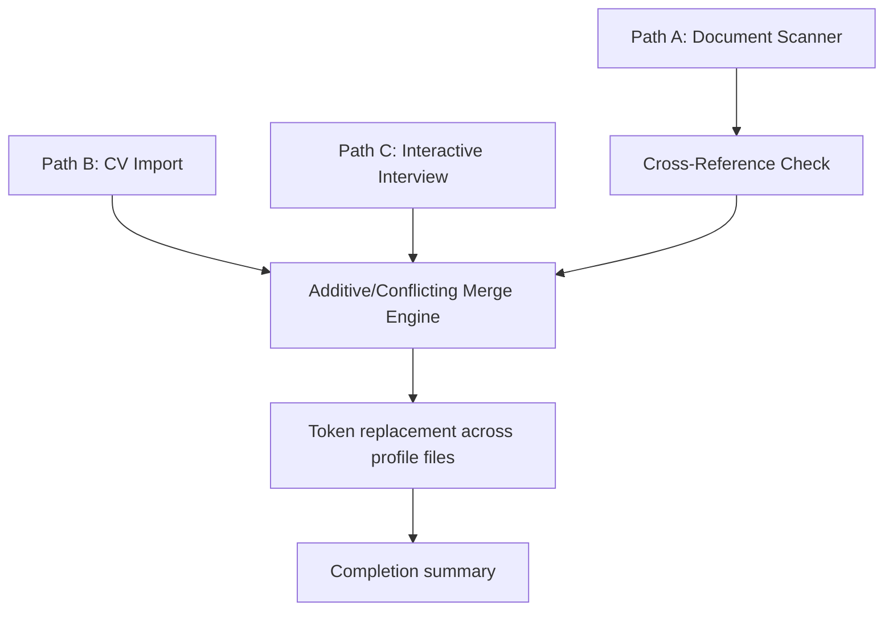

# Development — Implementation Guide: Profile & Onboarding

> **Purpose:** Technical implementation guidelines for building the profile management and `/setup` command features.
>
> **Status:** Draft
> **Last updated:** 2026-06-07
> **Owner persona:** Staff Engineer

---

## 0. Architecture Note — Prompt-as-Code

`/setup` is **not** a compiled program. Per ARCH-0001 (prompt-as-code) and
ARCH-0004 (file-as-DB), it is a Markdown instruction document at
`.claude/commands/setup.md` that the Claude Code assistant executes. There is
**no `settings/profile.json`** and **no `tools/cli.sh`**. The profile is stored
directly as human-readable Markdown across the target files listed in §2.

---

## 1. Onboarding Paths (`/setup`)

The `/setup` command initiates candidate onboarding via three distinct paths
(Path A, B, or C). All paths converge on the same set of profile files — the
`[UPPER_SNAKE_CASE]` placeholder tokens in those files are replaced with the
user's real data (REQ-0016).

### Target files (the convergence set)

| File | Role |
|------|------|
| `.claude/skills/job-application-assistant/01-candidate-profile.md` | Identity, education, experience, skills, publications, awards, references |
| `.claude/skills/job-application-assistant/02-behavioral-profile.md` | Behavioral traits, preferences, growth, posting keywords |
| `.claude/skills/job-application-assistant/04-job-evaluation.md` | Skill/experience match areas, career goals, motivation filters |
| `.claude/skills/job-application-assistant/05-cv-templates.md` | Profile-statement templates |
| `.claude/skills/job-application-assistant/07-interview-prep.md` | STAR examples + Path-A stubs |
| `CLAUDE.md` (user fork — from `CLAUDE.md.template`) | Union of profile data + workflow rules |
| `.claude/skills/job-scraper/search-queries.md` | Prioritized search queries + location tiers |

`03-writing-style.md` and `06-cover-letter-templates.md` are static framework
rules and are **not** modified by `/setup`.

---

## 2. Path Details

### Path A: Document Folder Scanner (REQ-0002–0012)
- **Logic:** Scan the structured `documents/` folder (`cv/`, `linkedin/`,
  `diplomas/`, `references/`, `applications/`).
- **Execution:**
  1. Read existing profile files first (read-before-write; idempotency baseline).
  2. Extract per subfolder using the supported formats for each
     (REQ-0003–0007). Cross-reference documents to build a consistent timeline
     and surface date/title/education/employer inconsistencies (REQ-0008).
  3. Classify proposed changes as additive or conflicting (§4) and confirm with
     the user before writing.
  4. Label inferred behavioral items (REQ-0010), record writing-style patterns
     only with ≥2 cover letters (REQ-0011), and create STAR stubs for
     uncovered achievements without fabricating S/T/A/R (REQ-0012).

### Path B: Single CV Import (REQ-0013)
- **Logic:** User pastes CV text or references a single CV file.
- **Execution:**
  1. Extract all structured information (same fields as REQ-0003).
  2. Identify gaps and ask targeted follow-up questions (behavioral profile,
     career goals, deal-breakers, salary expectations, references).
  3. Merge into the profile files via the same engine as Path A.

### Path C: Interactive Interview (REQ-0014)
- **Logic:** Conversational walkthrough of exactly nine sections, in order.
- **Sequence:**
  1. Identity & Contact
  2. Education
  3. Experience
  4. Technical Skills
  5. Publications / Awards *(optional)*
  6. Behavioral Profile *(optional)*
  7. Career Goals
  8. References *(optional)*
  9. Job Search Configuration
- **Style:** Questions are asked conversationally, not as a rigid form; optional
  sections are skippable; answers are synthesized into the structured token
  values.

---

## 3. Section-Level Re-Runs

The `/setup` command supports `--section <name>` for update-only flows:
- **Usage:** `/setup --section search`
- **Valid values:** `identity`, `education`, `experience`, `skills`,
  `certifications`, `publications`, `awards`, `behavioral`, `search`, `salary`,
  `interview-prep`, `writing-style` (REQ-0001).
- **Behavior:**
  1. Read the file(s) that own the target section.
  2. Ask only the questions needed to (re)fill that section's tokens.
  3. Merge the new inputs back (§4) and write only the affected files.

---

## 4. Profile Merging Rules

When new profile data is generated (via `/setup` or `/expand`), it is merged
into the existing profile files using the **Additive-Only Merge Engine**
(canonical rules: `business-rules-and-validation.md` §7).

### Rules Matrix
| Data Type | Merge Behavior | Handling Conflicts |
|---|---|---|
| **Simple Fields** (e.g. Email, Name) | Overwrite on explicit confirmation | Conflicting value presented one-at-a-time with keep/replace/manual |
| **Arrays / Lists** (e.g. Skills, Languages) | Union | Append new items; filter duplicates (idempotent) |
| **Work History / Projects** | Semantic match | Overlapping dates or same company → prompt user to select target or merge |
| **Behavioral (inferred)** | Append, labeled | Never overwrite scored assessments (REQ-0010) |

- **Additive changes** are presented as a grouped checklist by target file; the
  user can approve all or skip individual items.
- **Conflicting changes** are presented one at a time.
- **No file writes occur until the user confirms** (REQ-0009).
- **Idempotency:** re-running with the same inputs produces no new changes;
  source annotations on `/expand` additions prevent re-addition (§7.3).
