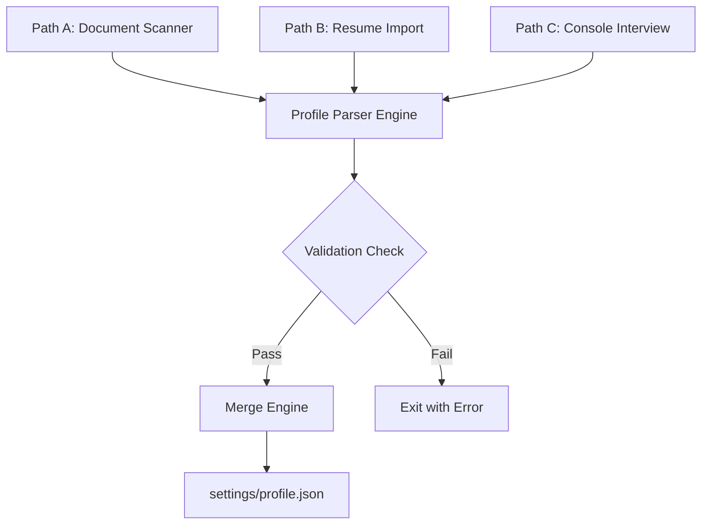

# Development — Implementation Guide: Profile & Onboarding

> **Purpose:** Technical implementation guidelines for building the profile management and `/setup` command features.
>
> **Status:** Draft
> **Last updated:** 2026-06-05
> **Owner persona:** Staff Engineer

---

## 1. Onboarding Paths (`/setup`)

The `/setup` CLI command initiates candidate onboarding via three distinct paths (Path A, B, or C). All paths must converge into a single structured YAML or JSON document saved at `settings/profile.json`.

---

## 2. Path Details

### Path A: Document Folder Scanner
- **Logic**: Iterates over files in a user-provided directory (`/documents/` by default).
- **Execution**:
  1. Filter out files based on a whitelist of file extensions (`.txt`, `.pdf`, `.md`, `.docx`).
  2. Parse file text contents.
  3. Send parsed text blocks to an LLM context. The system instructions guide the LLM to cross-reference documents to construct a consistent timeline and resolve conflicting dates.
  4. Generate a consolidated profile JSON.

### Path B: Single CV Import
- **Logic**: User uploads a single old CV/Resume document.
- **Execution**:
  1. Extract text contents of the CV.
  2. Analyze text using an LLM to identify gaps (e.g. missing dates, lack of descriptions for a specific project).
  3. Initiate an interactive terminal session asking the user 3–5 follow-up questions to fill those specific gaps.
  4. Combine original CV data and answers into the parser engine.

### Path C: Interactive Interview Shell
- **Logic**: Console-based questionnaire consisting of exactly 9 sections.
- **Sequence**:
  1. Contact Information & Online Presence (LinkedIn, GitHub)
  2. Professional Summary & Career Objectives
  3. Work History & Detailed Projects (Roles, Dates, Tasks)
  4. Educational Background & Academic Projects
  5. Technical & Hard Skills (Languages, Frameworks, Tools)
  6. Soft Skills & Communication Competencies
  7. Certifications & Languages
  8. Writing Style Parameters & Constraints
  9. Core Values & Preferred Work Conditions
- **State Preservation**: Store answers incrementally in a temporary file (`settings/setup_temp.json`) to allow recovery if the session is interrupted.

---

## 3. Section-Level Re-Runs

The `/setup` command supports the `--section <section_name>` option:
- **Usage**: `./tools/cli.sh /setup --section "work_history"`
- **Behavior**:
  1. Read the existing `settings/profile.json`.
  2. Clear only the target section.
  3. Run the interactive interview prompts for that section.
  4. Merge the new inputs back into the main profile structure.

---

## 4. Profile Merging Rules

When new profile data is generated (via `/setup` or `/expand`), it is merged into the existing `settings/profile.json` using the **Additive-Only Merge Engine**.

### Rules Matrix
| Data Type | Merge Behavior | Handling Conflicts |
|---|---|---|
| **Simple Fields** (e.g. Email, Name) | Overwrite | Keep user-entered value if conflicting. |
| **Arrays / Lists** (e.g. Skills, Languages) | Union | Append new items; filter duplicates. |
| **Work History / Projects** | Semantic Match | If overlapping dates or same company, prompt user to select target or merge details. |
| **Upskill Status** | Update Progress | Never overwrite completed course records. |
