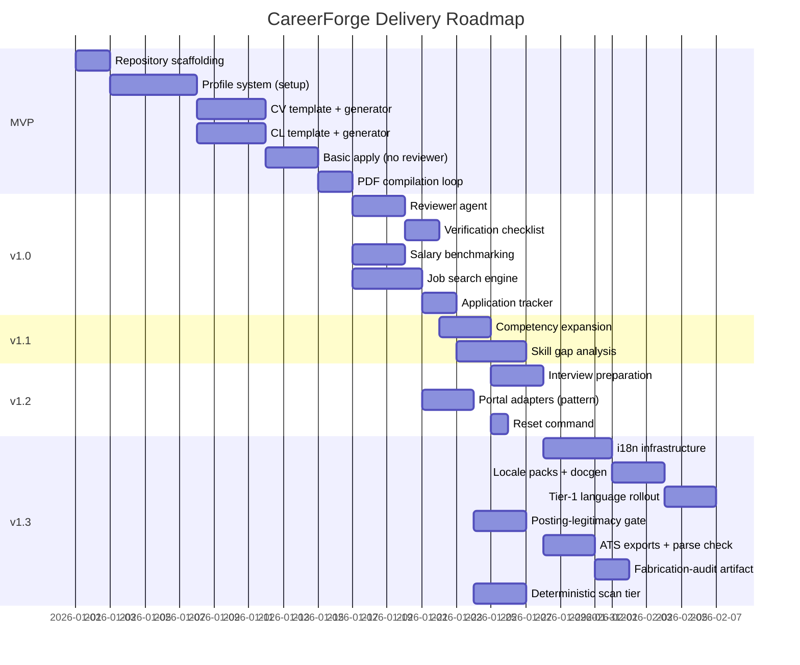

# Delivery Strategy

> **Purpose:** Defines the milestone-based delivery roadmap from MVP through full product.
>
> **Status:** Draft
> **Last updated:** 2026-06-05
> **Owner persona:** Technical Program Manager

---

## Release Philosophy

CareerForge follows an **incremental delivery** model. Each milestone delivers a usable product. Later milestones add capabilities without breaking earlier functionality.

---

## Milestone Overview

---

## Milestone Details

### MVP — Profile + Single Application
**Goal:** A user can set up their profile and generate a tailored CV + cover letter for one job.

| Feature | Requirements | Architecture |
|---------|-------------|-------------|
| Repository scaffolding | — | Data Architecture, Deployment |
| Profile setup (/setup) | REQ-0001–0017 | ARCH-0010 Profile Manager |
| CV template (moderncv) | REQ-2020 | ADR-0003 |
| Cover letter template | REQ-2021 | ADR-0003 |
| Basic /apply (no reviewer) | REQ-2001–2013, 2020–2024 | ARCH-0030 (steps 0–2) |
| PDF compilation & inspection | REQ-2050–2054 | ARCH-0030 (step 5) |
| Writing style enforcement | REQ-2022–2023 | Cross-cutting |

**Exit criteria:** User can run `/setup`, then `/apply <URL>`, and receive verified CV + cover letter PDFs.

### v1.0 — Full Application Pipeline + Search
**Goal:** Complete drafter-reviewer workflow, job search, and salary benchmarking.

| Feature | Requirements | Architecture |
|---------|-------------|-------------|
| Reviewer agent | REQ-2030–2033 | ADR-0002 |
| Revision engine | REQ-2040–2042 | ARCH-0030 (step 4) |
| Verification checklist | REQ-2060–2062 | ARCH-0030 (step 6) |
| Salary benchmarking | REQ-4001–4006 | ARCH-0050 |
| Job search engine | REQ-1001–1012 | ARCH-0020 |
| Application tracker | REQ-1009 | Data Architecture |

**Exit criteria:** Full /apply pipeline with reviewer; /search discovers and ranks jobs; salary lookup works.

### v1.1 — Career Development
**Goal:** Competency expansion and skill gap analysis.

| Feature | Requirements | Architecture |
|---------|-------------|-------------|
| Competency expansion (/expand) | REQ-0050–0055 | ARCH-0010 |
| Skill gap analysis (/upskill) | REQ-3001–3011 | ARCH-0040 |

**Exit criteria:** /expand enriches profile from additional sources; /upskill produces actionable gap reports.

### v1.2 — Interview Prep + Polish
**Goal:** Interview preparation, portal adapter pattern, and reset.

| Feature | Requirements | Architecture |
|---------|-------------|-------------|
| Interview preparation | REQ-3050–3054 | ARCH-0040 |
| Portal adapter pattern | NFR-0007 | ADR-0004 |
| Profile reset (/reset) | REQ-0080–0085 | ARCH-0010 |
| Research agent | — | Agent Layer |

**Exit criteria:** All commands functional; adapter pattern documented; ready for community contribution.

### v1.3 — Global Reach & Trust
**Goal:** Make CareerForge usable beyond English-speaking markets, harden it against fraudulent postings, and make generated documents ATS-safe and provably non-fabricated.

| Feature | Requirements | Architecture |
|---------|-------------|-------------|
| Internationalization & localization | REQ-7001–7011, NFR-0019–0020 | ADR-0007 |
| Posting-legitimacy gate (red-flags, ghost-job, scam catalog) | REQ-8001–8005 | ARCH-0020 |
| ATS-safe exports (TXT + DOCX) + parse self-check | REQ-2063–2065 | ARCH-0030 |
| Fabrication-audit / provenance artifact | REQ-2066 | ARCH-0030, Data Architecture |
| Deterministic scan tier + posting liveness | REQ-1013, REQ-1015, NFR-0021–0022 | ARCH-0020 |

**Scope:**
- Externalize every user-facing string into a single pluggable `i18n/` tree, rendered through ICU message formatting and translated via Weblate, with parity/staleness CI guarding a translation-completeness threshold (REQ-7001–7011, NFR-0020).
- Ship the Tier-1 set of 12 languages with RTL, CJK, and Indic script rendering, plus localized READMEs and docs-site (NFR-0019); leave the Tier-2 set of 20 as locale packs the community can complete.
- Add a posting-legitimacy gate that returns a verdict, surfaces red flags, detects ghost jobs, and matches against a locale-aware scam catalog (REQ-8001–8005).
- Emit ATS-safe plain-text and `.docx` exports alongside the existing polished LaTeX PDF, with an ATS parse self-check (REQ-2063–2065), and surface a fabrication-audit/provenance artifact to the user and the dashboard (REQ-2066).
- Add a deterministic, token-free scan tier and a posting-liveness re-check, with cost-aware search and provider-limit resilience (REQ-1013, REQ-1015, NFR-0021–0022).

**Exit criteria:** A non-English user can run the full workflow in a Tier-1 language; postings are screened for legitimacy with a surfaced verdict; every application ships ATS-safe TXT/DOCX exports plus a provenance artifact; search degrades gracefully under provider limits with a token-free tier.

### v2.0 — Community & Extensions (Future)
- Template marketplace
- Additional market-specific portal adapters
- GUI layer exploration
- ATS optimization module (if demand warrants)
