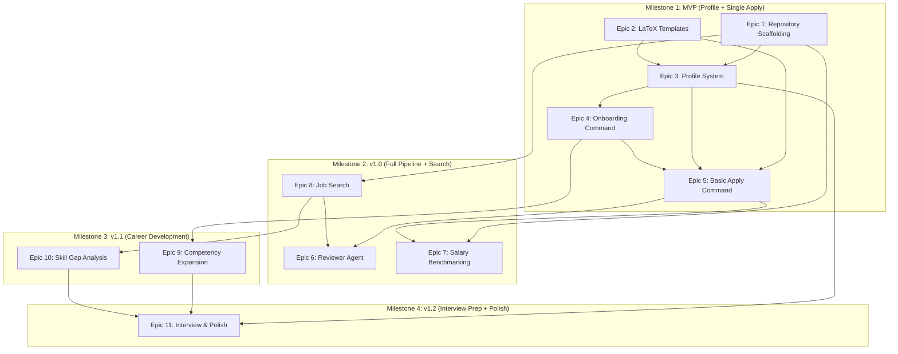

# Plan — Dependency Sequencing

> **Purpose:** Defines the execution sequence, task dependencies, and critical path for the CareerForge implementation.
>
> **Status:** Draft
> **Last updated:** 2026-06-05
> **Owner persona:** Technical Program Manager

---

## Dependency Graph

The following diagram illustrates the relationship and sequencing dependencies between the development epics.

---

## Critical Path Analysis

The critical path for CareerForge represents the sequence of dependent tasks that directly determines the minimum time required to deliver the system.

1. **Phase 1: Foundations (Epics 1 & 2)**
   - **T-001 (Directory Structure)** and **T-002 (.gitignore)** must be established first to avoid committing sensitive profiles or generated documents.
   - **T-010 (CV Template)** and **T-011 (Cover Letter Class)** must be created and verified locally using `lualatex` and `xelatex`.
2. **Phase 2: Profile & Onboarding (Epics 3 & 4)**
   - Profile documents (**T-020** to **T-027**) act as templates.
   - The `/setup` command (**T-030**) and its three convergence paths (**T-031** to **T-033**) parse documents and generate the profile.
3. **Phase 3: Basic Generation (Epic 5)**
   - `/apply` (**T-040**) depends on the profile manager, templates, and style rules.
   - The PDF compile-and-inspect loop (**T-044**, **T-045**) is the core technical bottleneck that must work perfectly before introducing AI reviewer agents.
4. **Phase 4: Agent Loop & Reviewer (Epic 6)**
   - The Reviewer Agent (**T-050** to **T-055**) builds directly on top of `/apply`'s generation step to introduce the correction and critique loop.

---

## Parallelization Strategy

To accelerate development, multiple developers or distinct AI assistant sessions can work in parallel on independent tracks:

| Track | Epic / Focus Area | Prerequisites |
|---|---|---|
| **Track A (Core Engine)** | Epic 1 (Scaffolding), Epic 3 (Profile), Epic 4 (Onboarding) | None |
| **Track B (Document Design)** | Epic 2 (LaTeX Templates), Epic 5 (Apply Generation) | Epic 1 |
| **Track C (Data & Scraping)** | Epic 7 (Salary Benchmarking), Epic 8 (Job Search) | Epic 1 |
| **Track D (Career & Advisor)** | Epic 9 (Competency Expansion), Epic 10 (Skill Gap), Epic 11 (Interview Prep) | Epic 4, Epic 8 |

---

## Task-Level Sequencing Matrix

The detailed step-by-step sequencing is outlined below, highlighting tasks that can run in parallel:

| Sequence | Task ID | Name | Parallel/Sequential | Blocked By |
|---|---|---|---|---|
| 1 | `T-001`–`T-009` | Scaffolding | Sequential | — |
| 2 | `T-010`–`T-014` | LaTeX Templates | Parallel with Epic 3 | `T-001` |
| 3 | `T-020`–`T-027` | Profile Skill Files | Parallel with Epic 2 | `T-001` |
| 4 | `T-030`–`T-036` | Onboarding | Sequential | `T-021`–`T-027` |
| 5 | `T-040`–`T-046` | Basic /apply | Sequential | `T-013`–`T-014`, `T-030` |
| 6 | `T-050`–`T-055` | Reviewer Agent | Sequential | `T-040` |
| 7 | `T-060`–`T-063` | Salary Tool | Parallel with Epic 6 | `T-001`, `T-041` |
| 8 | `T-070`–`T-076` | Job Search | Parallel with Epic 6 | `T-001` |
| 9 | `T-080`–`T-084` | Competency Expansion | Parallel with Epic 10 | `T-030` |
| 10 | `T-090`–`T-096` | Skill Gap | Parallel with Epic 9 | `T-076` |
| 11 | `T-100`–`T-104` | Interview Prep & Polish | Sequential | `T-080`–`T-096` |
