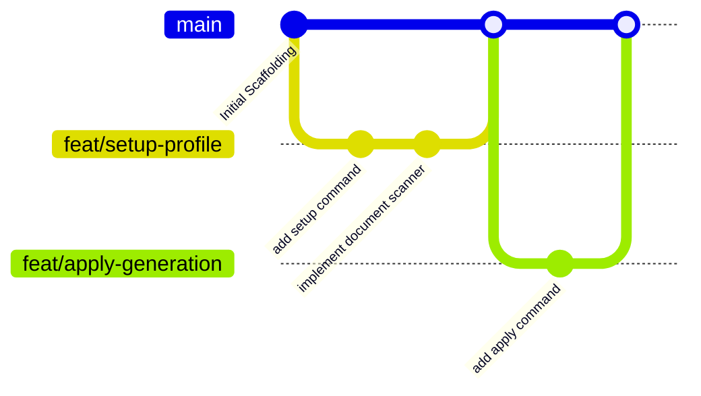

# Plan — Repository Setup

> **Purpose:** Outlines the repository structure, branching model, commit conventions, and open-source scaffolding required for CareerForge.
>
> **Status:** Draft
> **Last updated:** 2026-06-05
> **Owner persona:** Technical Program Manager

---

## Directory Structure

To support a local-first, file-based AI orchestration flow, the repository maintains a clean separation of configurations, source documents, user files, and compiled outputs.

```
{{WORKSPACE_PATH}}/
├── .github/                      # GitHub configurations
│   ├── issue_template/           # Templates for bugs, features
│   └── pull_request_template.md  # Standard PR description format
├── .gitignore                    # Local-first security and ignore rules
├── CLAUDE.md                     # AI developer assistant orchestration guide
├── LICENSE                       # MIT License
├── README.md                     # Product documentation and landing page
├── docs/                         # Clean-room specifications (this folder)
│   ├── architecture/
│   ├── development/
│   ├── plan/
│   ├── requirements/
│   └── testing/
├── cv/                           # Generated CV LaTeX sources and PDFs (gitignored except .gitkeep)
│   └── templates/                # Default LaTeX templates and styles (committed)
├── cover_letters/                # Generated Cover Letters (gitignored except .gitkeep)
│   └── templates/                # Default letter styles (committed)
├── documents/                    # Source profiles, resumes, and text files (gitignored except README)
├── settings/                     # User/app permissions and API keys (gitignored except template)
├── tools/                        # Utility scripts, scrapers, and converters
│   ├── adapters/                 # Job portal adapters
│   └── salary_lookup.py          # Salary benchmark utility
└── upskill/                      # Generated learning plans and STAR prep documents (gitignored)
```

---

## Git Branching Strategy

CareerForge uses **Trunk-Based Development** with short-lived feature branches to maintain velocity while enabling automated CI testing.



### Workflow Rules
1. **Protected Main**: Direct commits to `main` are blocked. All code must enter via Pull Requests.
2. **Short-Lived Branches**: Branches should target a single task (e.g. `feat/T-030-setup-cmd` or `fix/T-044-pdf-compile`) and be merged within 48 hours.
3. **Linear History**: Rebase and squash merging is enforced to keep the history clean.

---

## Commit Conventions

Commit messages must adhere to the **Conventional Commits 1.0.0** specification. This enables automated changelog generation and clear version boundaries.

Format: `<type>(<scope>): <description>`

### Types
- `feat`: A new feature or command (e.g., `feat(apply): add compile-and-inspect loop`)
- `fix`: A bug fix (e.g., `fix(setup): correct pdf metadata parsing`)
- `docs`: Documentation-only changes (e.g., `docs(plan): add repository setup layout`)
- `style`: Changes that do not affect the meaning of the code (formatting, missing semi-colons)
- `refactor`: A code change that neither fixes a bug nor adds a feature
- `test`: Adding missing tests or correcting existing tests
- `chore`: Update build tasks, package configurations, or system paths

---

## Open-Source Scaffolding

### LICENSE
CareerForge is licensed under the **MIT License**. This allows maximum community adoption, integration, and modification while protecting the maintainers from liability.

### README.md Outline
1. **Header & Logo**: Project working name (**CareerForge**) and tagline.
2. **Features**: Quick bullet list of capabilities.
3. **Getting Started**:
   - Prerequisites (`uv`, `lualatex`, `xelatex`).
   - Quick start command: `./tools/bootstrap.sh`.
4. **Command CLI Reference**: Table of `/setup`, `/apply`, `/search`, `/expand`, `/upskill`, `/reset`.
5. **Security & Privacy Policy**: Detailed explanation of the local-first architecture (no data leaves the machine except direct API requests to user-configured LLM providers).

### CONTRIBUTING.md Guidelines
- Core philosophy: "Focus on clean-room, robust integrations."
- Forking & branch policies.
- Style guide check (Linting, TypeScript/Python conventions).
- Testing expectations: Unit tests required for new adapters; manual validation checklist runs for prompt modifications.

### CODE_OF_CONDUCT.md
- Adheres to the standard **Contributor Covenant v2.1** to ensure a welcoming, inclusive, and professional community.
