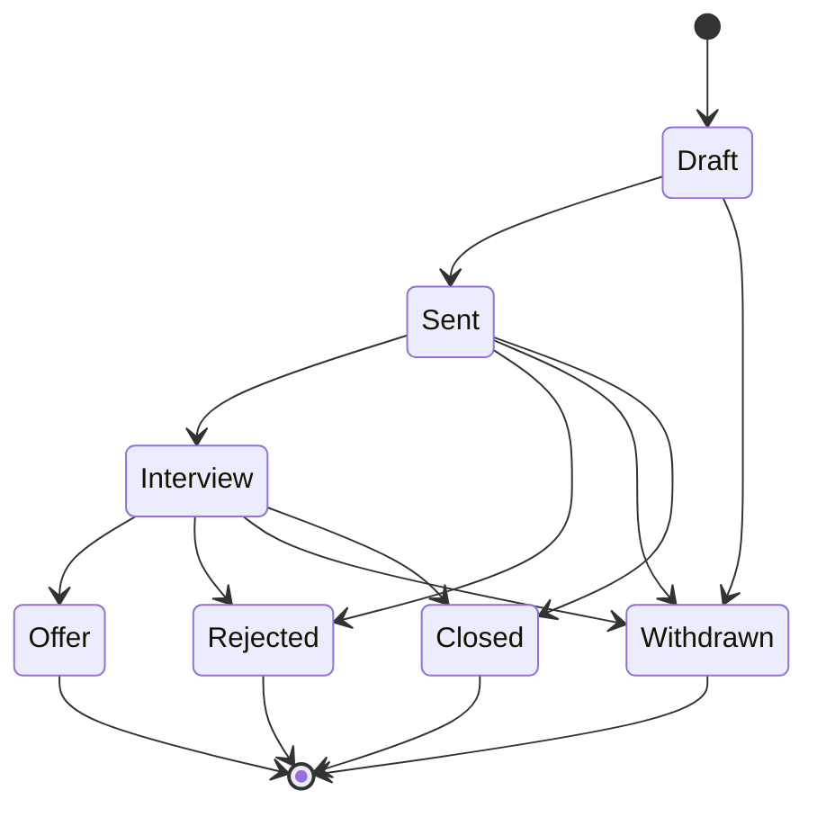

# Business Rules & Validation

> **Purpose:** Documents the scoring frameworks, validation constraints, state transitions, permission rules, and content quality algorithms that govern CareerForge behavior.
>
> **Status:** Draft
> **Last updated:** 2026-06-05
> **Owner persona:** Business Analyst

---

## 1. Job Fit Evaluation Framework

### 1.1 Scoring Dimensions

| Dimension | Weight | Scale | Description |
|-----------|--------|-------|-------------|
| Technical Skills Match | 30% | 0–100 | Alignment between required/preferred skills and user capabilities |
| Experience Match | 25% | 0–100 | Relevance of work history to the role |
| Behavioral/Culture Fit | 15% | 0–100 | Match between behavioral profile and role/company culture |
| Career Alignment | 30% | 0–100 | Whether the role advances career goals and contains energizing tasks |
| Location & Logistics | — | Pass/Fail | Commute feasibility; deal-breaker if relocation required |

### 1.2 Score Interpretation

| Range | Technical Skills | Experience Match | Behavioral Fit | Career Alignment |
|-------|-----------------|------------------|----------------|------------------|
| 80–100 | Core requirements are primary skills | Direct experience in same domain/role | Culture strongly matches preferences | Strongly aligned, clear growth path |
| 60–79 | Most match, 1–2 learnable gaps | Related experience, transferable skills clear | Mixed but mostly compatible | Good but only partially aligned |
| 40–59 | Partial match, significant upskilling needed | Adjacent experience, must make the case | Some friction areas | Decent job, doesn't build toward goals |
| 0–39 | Fundamental mismatch | Unrelated experience | Significant culture mismatch | Dead end or backwards step |

### 1.3 Verdict Thresholds

| Overall Score | Verdict | Action |
|---------------|---------|--------|
| 75+ | Strong Fit | Definitely apply, tailor everything |
| 60–74 | Good Fit | Apply, address gaps in cover letter |
| 45–59 | Moderate Fit | Consider carefully, discuss with user |
| 30–44 | Weak Fit | Probably skip unless strategic reasons |
| <30 | Poor Fit | Skip |

### 1.4 Motivation Evaluation

Beyond skill match, evaluate whether the role's tasks will **energize** the user:
- Tasks that energize (user-configured)
- Tasks that drain (user-configured)
- Non-task factors: leadership style, department culture, company values, degree of autonomy

### 1.5 Location Filter Rules

| Zone | Action |
|------|--------|
| Within commute range | PASS |
| Remote with occasional office | PASS |
| Requires relocation | FAIL (deal-breaker) |
| Frequent international travel | FLAG (discuss with user) |

---

## 2. CV Page Budget

### 2.1 Hard 2-Page Limit

The CV must compile to exactly 2 pages. No exceptions.

| Section | Maximum Budget |
|---------|---------------|
| Profile statement | 3–4 lines |
| Core competencies | 5 items, each 1–2 lines |
| Most recent role | 4–5 bullets |
| Previous role | 2–3 bullets |
| Older roles | 2 bullets (1 line each) |
| Education | 2–3 entries |
| Publications | 2–3 entries |
| Awards | 3 entries, single line each |
| References | "Available upon request." (single line) |

**Rule:** If in doubt, cut rather than squeeze. Reducing spacing or margins to force-fit content makes the CV look cramped.

### 2.2 Relevance-Weighted Cutting Algorithm

When the CV exceeds 2 pages, content is cut by signal quality rather than mechanical section priority.

**For every candidate line, score three dimensions:**

1. **Relevance** — Does the line hit a named tool, keyword, or stated responsibility in the job posting?
2. **Uniqueness** — Is it the only place this claim appears, or is it duplicated elsewhere?
3. **Narrative Load** — Does the cover letter depend on it? If cutting would force a cover letter rewrite, it is load-bearing.

**Cut the lowest-total-score line first, regardless of section.**

### 2.3 Practical Cutting Order (Easiest → Last Resort)

1. **Redundancy** — Achievement appears in both Core Competencies AND a role bullet → cut the Core Competencies version
2. **Profile statement fluff** — Sentences that restate what other sections show
3. **Low-relevance experience bullets** — Bullets not touching posting keywords, from any role
4. **Low-relevance supporting content** — Older-role bullets, certifications, language entries that don't match the posting
5. **Low-relevance publications** — Keep 1–2 best-matching publications
6. **Last-resort structural cuts** — Oldest education, oldest role compression, certification collapse

### 2.4 Cutting Pitfalls

- Do NOT mechanically cut from the bottom of a static section list without checking relevance
- Do NOT cut the concrete example the cover letter depends on
- For borderline cases (2.02 pages), prefer `\enlargethispage` over content cuts

---

## 3. Cover Letter Constraints

### 3.1 Hard 1-Page Limit

The cover letter must compile to exactly 1 page, including the signature block. No exceptions.

- **Word budget:** 250–300 words of body text (not counting LaTeX markup)
- **350 words will overflow** — treat 300 as the hard ceiling
- **Block count:** Opening + bullet list + closing = 3 blocks. Add a 4th only if others are short.
- When adding company-specific content, trim other content to compensate rather than adding net length

### 3.2 Cutting Rules for Cover Letters

1. First cut: sentences that restate what a bullet already says
2. Second cut: a bullet that does not hit posting keywords
3. Last resort: a bullet that does hit posting keywords
4. **Never** reduce geometry or line spacing to fit

---

## 4. Writing Quality Rules

### 4.1 Absolute Prohibitions

| Rule | Example of Violation |
|------|---------------------|
| No em-dashes (--) | "My experience -- spanning..." → Use comma or period |
| No clichés/filler | "I am passionate about", "hit the ground running", "leverage my skills" |
| No generic buzzwords without backing | "Results-driven" without a specific result |
| No apologetic language | "I think I could contribute" → "I bring X, demonstrated by Y" |
| No unverified company claims | Must be independently verified via web search |
| No fabricated skills/experience | Every claim must match the profile |

### 4.2 Interview Backtrack Test

For every claim in the CV or cover letter, apply this test:

> Could the candidate comfortably explain this in an interview without having to say "well, what I actually meant was..."?

| Outcome | Action |
|---------|--------|
| Passes | Keep the claim |
| Falls in "flag it" zone | Present to user: "This is a stretch because X. Keep, soften, or drop?" |
| Fails | Rewrite or remove |

### 4.3 Reframing Boundaries

| Acceptable | Flag It | Never |
|-----------|---------|-------|
| Reordering experience to lead with relevance | Combining academic + industry into a single claim implying all industry | Claiming experience the user doesn't have |
| Using natural synonyms for the target domain | Using the posting's specific terminology when actual work was adjacent | Implying work in a domain they haven't touched |
| Emphasizing one aspect of a broad role | | |

### 4.4 Tool Naming Rule

When generated CVs or cover letters reference the candidate's use of agentic coding tools or AI assistants, the **specific tool name** shall appear — never a generic term.

**Default tool name:** **Claude Code** (used when no override is configured in the candidate profile).

**Override:** The candidate profile may specify a different tool name (e.g., "Cursor", "GitHub Copilot", "Windsurf"). When an override is present, the configured name is used in all generated documents.

**Examples:**

| Situation | Acceptable | Never |
|-----------|-----------|-------|
| Candidate uses Claude Code | "…using Claude Code for agentic coding workflows" | "…using an AI assistant", "…using AI coding tools" |
| Candidate uses Cursor | "…using Cursor for AI-assisted development" | "…using an AI IDE" |
| Multiple tools used | List each by name | "…using various AI tools" |

**Rationale:** See DEC-017. Named tools are verifiable hiring signals; generic AI mentions are not.

---

## 5. Verification Checklist Rules

The verification checklist runs **exactly once**, at the end of the application pipeline (Step 6). The reviewer does not run it.

### 5.1 Factual Accuracy
- All claims match actual profile — no fabricated skills, experience, or achievements
- Job titles, dates, company names, and locations are correct
- Contact details are correct
- All company-specific claims independently verified via web search

### 5.2 Targeting
- Profile statement tailored to the specific role (not generic)
- Skills and experience reframed to match job requirements
- Key job requirements addressed (gaps acknowledged where relevant)
- Nice-to-have requirements highlighted where there is a match

### 5.3 Consistency
- CV follows the standard 2-page format
- Cover letter uses the established template structure
- Tone is consistent across CV and cover letter
- No contradictions between the two documents

### 5.4 Quality
- No LaTeX syntax errors (balanced braces, correct commands)
- No spelling or grammar errors
- AI tool references mention the AI assistant by name
- Cover letter addressed to the correct person (or "Dear Hiring Manager")
- Cover letter fits on one page

### 5.5 Compiled PDF Verification
- CV compiled with lualatex; cover letter with xelatex
- CV is exactly 2 pages
- No orphaned entry titles
- Cover letter is exactly 1 page with visible signature
- Cover letter bullet font matches body font

---

## 6. Deduplication Rules

### 6.1 Seen Jobs Registry
- Key: URL or company+title combination
- Once a job is in the registry, it is never presented again
- Both "new" and "skipped" jobs are recorded
- Registry is persistent across search sessions

### 6.2 Tracker Integration
- Jobs with an existing row in the application tracker are also deduplicated
- Company+role matching prevents re-presenting jobs already applied to

---

## 7. Onboarding Merge Rules

### 7.1 Additive Changes
- New content not present in any form in the skill file
- Applied in bulk with user confirmation
- User can skip individual items

### 7.2 Conflicting Changes
- Content that disagrees with existing file content
- Presented one at a time with keep/replace/manual options
- User resolves each before writes proceed

### 7.3 Idempotency
- Re-running onboarding with the same documents produces no new changes
- Source annotations on expanded competencies prevent re-addition
- Cross-reference check uses existing file state as baseline

---

## 8. Skill Gap Scoring

### 8.1 Aggregate Mode — Fit-Weight Formula

For each skill mentioned across tracked jobs:

```
gap_score = Σ ((100 - fit_rating) / 100) × occurrence
```

Where `fit_rating` is the job's overall fit score (0–100). Lower-fit jobs contribute more to the gap score because they expose bigger gaps.

### 8.2 Priority Assignment

| Priority | Criteria (Aggregate) | Criteria (Targeted) |
|----------|---------------------|---------------------|
| Critical | High frequency + high weight scores | Required skill |
| High | Moderate scores OR consistent soft/tooling gaps | Required skill (lower emphasis) |
| Medium | Lower-frequency OR synthesized gaps in few roles | Preferred skill OR inferred gap |
| Low | One-off mentions or minor nice-to-haves | Inferred nice-to-have |

### 8.3 Profile Matching Rule

When determining whether a skill is already in the profile, use **generous matching:**
- "Python" covers "Python scripting"
- "Machine learning" covers "ML"
- Err toward removing from the gap list (avoid false positives)

---

## 9. Application Status Enum

The `status` column on every tracker row (REQ-5004, data-requirements §11) is drawn from a fixed enum. The dashboard exposes this enum as a dropdown; `/apply` writes only `Draft` or `Sent` on append.

### 9.1 Canonical Values

| Value | Meaning | Set by |
|-------|---------|--------|
| `Draft` | Application materials generated but not submitted | `/apply` on initial draft completion |
| `Sent` | Application submitted to the employer | User (via dashboard or manual CSV edit) |
| `Interview` | Employer responded with an interview request | User |
| `Offer` | Employer extended an offer | User |
| `Rejected` | Employer declined or rejected | User |
| `Withdrawn` | User withdrew the application | User |
| `Closed` | Position closed/filled without an outcome for this candidate | User |

### 9.2 Allowed Transitions



### 9.3 Transition Rules

- The dashboard's status dropdown shows **only allowed next states** for the current row, plus the current state. Disallowed transitions are not selectable.
- The dashboard does not enforce one-way states at the data layer — a user editing the CSV by hand can move freely. The UI guidance is advisory, not a guarantee.
- `Closed`, `Rejected`, `Withdrawn`, and `Offer` are terminal for dashboard navigation purposes (rows in these states are visually de-emphasized per REQ-5001), but the user may still move out of them via manual CSV edit.

### 9.4 De-emphasis Set

For visual treatment in the dashboard (REQ-5001), the **muted set** is: `Rejected`, `Withdrawn`, `Closed`. Rows in these states render with reduced opacity but remain interactive.

### 9.5 Pipeline KPI Buckets

For REQ-5003 pipeline counts, the buckets are: `Draft`, `Sent`, `Interview`, `Offer`, `Rejected`, `Withdrawn`, `Closed`. The "interviews-per-application rate" KPI uses `Interview` (numerator) over `Sent + Interview + Offer + Rejected + Withdrawn + Closed` (denominator) within the active window.

---

## 10. Posting Legitimacy & Red Flags

Governs the standalone legitimacy gate (REQ-8001, REQ-8002, trust-and-safety §Step 0). This gate answers *"should you trust this posting?"* — a different question from *"is this posting right for you?"*, which the fit framework (§1) answers. The two are computed and presented **independently**.

### 10.1 Legitimacy Is a Separate Gate, Not a Scoring Dimension

This is an **owner-locked decision** and must not be re-litigated in implementation.

- The posting-legitimacy assessment produces a **verdict** — one of `Verified` / `Caution` / `Suspicious` — computed and presented **independently** of the 0–100 five-dimension fit score defined in §1 (Job Fit Evaluation Framework).
- Legitimacy is **never** added as a sixth dimension to §1.1, and it **never** contributes to or modifies the overall fit number in §1.3. It sits **beside** the fit evaluation, in its own reported section.
- **Rationale:** a scam that is otherwise an excellent fit must not average out to a high "apply" score and slip through. A posting could score 85 (Strong Fit, §1.3) and still be `Suspicious`. Folding legitimacy into the fit score would let a legitimacy problem be masked by a strong fit. Keeping the gate orthogonal prevents that.
- **Cross-reference only:** §1 (the five-dimension fit framework) is unchanged by this section. Legitimacy is assessed in parallel and reported separately; the fit score is computed exactly as §1 specifies.

### 10.2 Red-Flag Signal Set

Signals are **externalized, country-agnostic data** (id, description, severity, locale scope) — not hardcoded branching logic. Adding or tuning a signal does not change the assessment engine. Each fired signal contributes **evidence** toward the verdict and carries the posting text that triggered it (for citation per §10.4).

| Signal | What it detects | Default severity |
|--------|-----------------|------------------|
| Upfront fees / payments | Any request for money from the applicant — training fees, equipment deposits, "processing" charges | Strong |
| Personal-data / ID / banking harvesting | Requests for government ID numbers, bank or card details, or identity-document copies before a legitimate offer stage | Strong |
| Off-platform redirects | Pushing the conversation to untraceable channels (personal messaging apps, throwaway email) early in the process | Strong |
| Too-good-to-be-true compensation | Pay or benefits implausibly high for the stated role and effort | Soft |
| Vague / absent company identity | No verifiable company name, address, registration, or web presence | Soft |
| High-pressure tactics | Artificial urgency, "act now," or coercion to skip normal hiring steps | Soft |
| Unverifiable contact details | No legitimate corporate contact path; only anonymous or free-mail addresses | Soft |

Severity is parameterized data, not baked-in code; thresholds and examples make no assumption about country, currency, language, or portal.

### 10.3 Verdict Rules

The verdict is exactly one of three values, derived from the signals that fired:

| Verdict | Condition | Action |
|---------|-----------|--------|
| `Verified` | No material red flags; an identifiable, legitimate employer | Proceed normally; note that no red flags were found |
| `Caution` | Some unverifiable elements or one or more minor (soft) flags only | Proceed with care; surface the soft signals and their evidence |
| `Suspicious` | One or more strong scam signals fired | Strongly discourage; warn plainly and ask whether to proceed anyway — **never auto-block** |

A single soft signal maps to at most `Caution`; any strong signal maps to `Suspicious`. No single signal silently blocks the user (§10.4).

### 10.4 Invariants

These hold regardless of the verdict and trace to architecture invariants:

- **The system warns, the user decides (ARCH-0006).** A `Suspicious` verdict is advisory: the user is warned plainly and asked whether to proceed. The gate **never** auto-blocks, auto-skips, or removes a posting on the user's behalf.
- **Never fabricate a scam accusation without cited evidence (ARCH-0007).** Every fired signal and every verdict reason must cite the specific posting text that triggered it. No reason is asserted without evidence. State uncertainty honestly rather than asserting a conclusion the evidence does not support.
- **Fail open, neutrally (ARCH-0005).** If signals cannot be gathered (content too sparse, signals unavailable), the gate returns a neutral "legitimacy could not be assessed" note and the pipeline continues — it does not abort, and it does not default to alarm.
