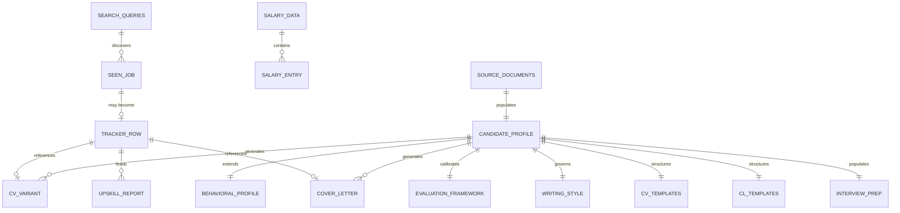

# Data Requirements

> **Purpose:** Defines the conceptual data model for CareerForge — the entities, attributes, relationships, lifecycle, and constraints governing all persistent data.
>
> **Status:** Draft
> **Last updated:** 2026-06-05
> **Owner persona:** Business Analyst

---

## Overview

CareerForge uses a file-based data model. All data is stored as structured text files (Markdown, JSON, CSV, LaTeX) within the repository. There is no database. This design supports version control, portability, and transparency.



---

## 1. Candidate Profile

**File:** `.claude/skills/job-application-assistant/01-candidate-profile.md`

| Attribute | Type | Required | Description |
|-----------|------|----------|-------------|
| Name | String | Yes | Full name |
| Location | String | Yes | Address, city, country |
| Phone | String | Yes | Mobile number |
| Email | String | Yes | Email address |
| LinkedIn | URL | Should | LinkedIn profile URL |
| GitHub | URL | Could | GitHub profile URL |
| Languages | List<Language, Proficiency> | Yes | Spoken languages with levels |
| Employment Status | String | Yes | Current status |
| Constraints | String | Should | Commute/location constraints |
| Education | List<EducationEntry> | Yes | Degrees in reverse chronological order |
| Experience | List<ExperienceEntry> | Yes | Roles in reverse chronological order |
| Independent Projects | List<Project> | Could | Non-employment projects |
| Technical Skills | Categorized skill lists | Yes | Primary, secondary, domain, tools |
| Publications | List<Publication> | Could | Peer-reviewed publications |
| Awards | List<Award> | Could | Awards and competitions |
| References | List<Reference> | Should | Professional references |

**EducationEntry:** Degree, Field, Period, Institution, Key Topics, Thesis (optional)
**ExperienceEntry:** Title, Company, Period, Location, Responsibilities/Achievements (list)
**Reference:** Name, Title, Company, Contact info

**Lifecycle:** Created during onboarding. Updated by /expand (additive only). Reset by /reset profile.

---

## 1.5 CLAUDE.md Roles

CLAUDE.md serves two distinct roles in this framework's ecosystem.

**Role A — Framework-development CLAUDE.md (in CareerForge's own repo).** Project memory for developers building CareerForge. Points at `/docs` and cross-references. Lives in the repo root at the CareerForge framework repo. This is what `CLAUDE.md` means in our own project memory and instructions.

**Role B — User-fork CLAUDE.md (in a fork of CareerForge).** The user's candidate profile + workflow rules + verification checklist, populated by `/setup` from the framework's template. Read by the assistant on every turn during `/apply`, `/scrape`, etc.

**The template** for Role B is shipped at `CLAUDE.md.template` in the framework repo and contains placeholder tokens that `/setup` replaces with the user's actual data.

## 1.6 Candidate-Profile Template Schema

Required sections (in order) in the Role B CLAUDE.md:

- **Identity** — name, location, languages, employment status, LinkedIn headline
- **Education** — degrees with field, institution, dates, thesis
- **Professional Experience** — roles with title, company, dates, location, responsibilities, achievements
- **Technical Skills** — Primary / Secondary / Domain / Software
- **Certifications**
- **Publications**
- **Awards**
- **Behavioral Profile** — traits, strengths, growth areas, ideal environment
- **What Excites You**
- **Target Sectors**
- **Deal-breakers**

Workflow sections (in order):

- **Role** — one-paragraph framing of what Claude does in this workspace
- **Repo Structure** — pointer at the bundled directories
- **Workflow for New Job Applications** — the 5-step pipeline
- **Verification Checklist** — Factual accuracy / Targeting / Consistency / Quality / Compiled PDF verification

Token-replacement placeholders in the template use `[UPPER_SNAKE_CASE]` form (e.g., `[YOUR_NAME]`, `[DEGREE_LEVEL]`, `[FIELD]`, `[INSTITUTION]`, `[JOB_TITLE]`, `[COMPANY]`, `[YOUR_PRIMARY_SKILLS]`, `[DEALBREAKER_1]`). `/setup` replaces these from user input or document extraction.

---

## 2. Behavioral Profile

**File:** `.claude/skills/job-application-assistant/02-behavioral-profile.md`

| Attribute | Type | Required | Description |
|-----------|------|----------|-------------|
| Overview | String | Yes | 1–2 sentence summary with profile type |
| Core Behavioral Drives | Table<Drive, Level, Meaning> | Should | From formal assessment or self-assessment |
| Strongest Behaviors | List<Behavior, Description> | Yes | Key behavioral traits |
| Work Preferences | List<Preference> | Yes | Environment and work style preferences |
| Growth Areas | List<Area, Positive Framing> | Should | Weaknesses framed constructively |
| Posting Language Mapping | Two lists: strong fit keywords, potential friction keywords | Should | Maps profile traits to posting language |
| Management Style Preferences | List<Preference> | Should | What management style works/doesn't |
| Application Usage | Guidance per document type | Should | How to use behavioral data in applications |

**Lifecycle:** Created during onboarding. Extended by /expand with labeled inferred items. Scored assessments never overwritten by inference.

---

## 3. Writing Style Guide

**File:** `.claude/skills/job-application-assistant/03-writing-style.md`

| Attribute | Type | Required | Description |
|-----------|------|----------|-------------|
| Critical Rules | List<Rule> | Yes | Absolute prohibitions (em-dashes, clichés, fabrication) |
| Tone Guidelines | Prose | Yes | Warm but direct, conversational professional |
| Application Headline Formula | Template | Should | Subject line construction pattern |
| Scannable Structure Guidelines | List<Guideline> | Should | Layout for quick reading |
| Forward-Looking Framing Rules | List<Rule> | Yes | Cover letter is not a CV repetition |
| Cover Letter Structure | Section-by-section guide | Yes | Opening, body, motivation, company-specific, closing |
| Bullet Point Style | Rules | Yes | Action verbs, specificity, variation |
| Role-Type Language Variants | Per-type guidance | Should | Technical, domain, consulting, leadership |
| Multi-Language Rules | Guidelines | Should | Language matching and localization |

**Lifecycle:** Static framework rules; not modified by onboarding. Patterns may be observed and recorded by Path A if ≥2 cover letters exist.

---

## 4. Job Evaluation Framework

**File:** `.claude/skills/job-application-assistant/04-job-evaluation.md`

| Attribute | Type | Required | Description |
|-----------|------|----------|-------------|
| Scoring Dimensions | 5 dimension definitions with rubrics | Yes | Technical, Experience, Behavioral, Location, Career |
| Dimension Weights | Percentages | Yes | 30/25/15/30 |
| Skill Match Areas | Three categories: strong/moderate/weak | Yes | User's skill assessment |
| Experience Match Areas | Three categories: strong/moderate/entry | Yes | User's experience assessment |
| Career Goals | List<Goal> | Yes | User's career direction |
| Motivation Filters | Lists: energizing/draining tasks | Should | What motivates vs. demotivates |
| Life Situation Context | Security, flexibility, growth priorities | Could | Personal constraints |
| Salary Benchmark Integration | Tool invocation pattern | Could | How to include salary data |
| Output Format | Template | Yes | Structured evaluation table |
| Verdict Thresholds | Score→verdict mapping | Yes | 75+/60–74/45–59/30–44/<30 |
| Pre-Application Call Guidance | Rules | Should | When and how to call employers |

**Lifecycle:** Framework structure is static. Skill/experience areas and career goals updated during onboarding. May be calibrated by past application outcomes (Path A).

---

## 5. CV Templates

**File:** `.claude/skills/job-application-assistant/05-cv-templates.md`

| Attribute | Type | Required | Description |
|-----------|------|----------|-------------|
| Template Definition | LaTeX document class + structure | Yes | moderncv/banking configuration |
| Color Override Rules | LaTeX commands | Yes | Force consistent blue scheme |
| Spacing Rules | Do's and don'ts | Yes | No inter-item vspace in itemize |
| Profile Statement Templates | Per-role-type templates | Yes (populated by /setup) | Elevator pitch variants |
| Section Tailoring Guidelines | Per-section guidance | Yes | How to customize each section |
| Employment Gap Handling | Guidelines | Should | How to explain gaps |
| Page Budget | Section-level limits | Yes | Hard 2-page limit enforcement |
| Relevance-Weighted Cutting | Algorithm description | Yes | How to shrink when overflow |
| Compile-and-Inspect Instructions | Step-by-step | Yes | Mandatory verification |
| Section Order Variants | Per-role-type ordering | Yes | Technical vs. domain-specific |

**Lifecycle:** Framework is static. Profile statement templates populated by /setup, cleared by /reset.

---

## 6. Cover Letter Templates

**File:** `.claude/skills/job-application-assistant/06-cover-letter-templates.md`

| Attribute | Type | Required | Description |
|-----------|------|----------|-------------|
| Template Definition | LaTeX class + structure | Yes | Custom cover letter class |
| Compile Instructions | Commands + known pitfalls | Yes | xelatex, itemize/fontspec pattern |
| Document Structure | LaTeX template | Yes | Full document skeleton |
| Key Commands Reference | Table | Yes | Template-specific LaTeX commands |
| Tailoring Guidelines | Per-section rules | Yes | Salutation, length, bullets, languages |
| Length Constraints | Hard limits | Yes | 1 page, 250–300 words |
| Finalization Checklist | Checklist | Yes | Pre-submission quality checks |
| Submission Guidelines | Best practices | Should | File naming, format, anonymity |

**Lifecycle:** Static framework; not modified by /setup or /reset.

---

## 7. Interview Preparation

**File:** `.claude/skills/job-application-assistant/07-interview-prep.md`

| Attribute | Type | Required | Description |
|-----------|------|----------|-------------|
| STAR Format Definition | Framework | Yes | S/T/A/R structure with guidance |
| Ready-Made STAR Examples | List<STARExample> | Yes (populated by /setup) | 3–6 examples from actual experience |
| STAR Candidates | List<STARStub> | Could | Stubs from Path A for user completion |
| Tough Questions | Per-question guidance | Yes | Common difficult questions with framing |
| Questions to Ask | Categorized lists | Yes | Role, team, tech, culture |
| Phone/Video Tips | List | Should | Practical interview advice |
| Follow-Up Etiquette | Guidelines | Should | Post-application/interview rules |
| Roleplay Guidelines | Step-by-step | Should | How to run practice sessions |

**STARExample:** Title, Skill Demonstrated, S, T, A, R, Applicable Question Types
**STARStub:** Title, Source, What Happened, Why It Matters, Empty S/T/A/R

**Lifecycle:** STAR examples populated by /setup, cleared by /reset. Framework content preserved through reset.

---

## 8. Main Profile Document

**File:** `CLAUDE.md` (repository root)

Serves as the primary AI context file. Contains:
- Role definition
- Complete candidate profile (mirror of skill file data)
- Repository structure overview
- Workflow instructions
- Verification checklist

**Lifecycle:** Placeholder tokens replaced during /setup. Contains the union of all profile data.

---

## 9. Search Queries

**File:** `.claude/skills/job-scraper/search-queries.md`

| Attribute | Type | Required | Description |
|-----------|------|----------|-------------|
| Search Sites | List<Site> | Yes | Job portals to search |
| Priority 1 Queries | List<Query> | Yes | Primary role type searches |
| Priority 2 Queries | List<Query> | Yes | Domain expertise searches |
| Priority 3 Queries | List<Query> | Should | Adjacent role searches |
| Priority 4 Queries | List<Query> | Could | Broader/wider-net searches |
| Location Filter Tiers | Categorized zones | Yes | Ideal, acceptable, borderline, too far |
| Date Filter Rule | Constraint | Yes | 14 days or unexpired deadline |

**Lifecycle:** Populated during /setup. Can be re-run independently via `--section search`.

---

## 10. Seen Jobs Registry

**File:** `job_scraper/seen_jobs.json`

```json
{
  "seen": {
    "<url_or_company_title_key>": {
      "title": "string",
      "company": "string",
      "url": "string",
      "first_seen": "YYYY-MM-DD",
      "fit": "high|medium|low",
      "status": "new|skipped|evaluated"
    }
  }
}
```

**Lifecycle:** Created on first search (empty if missing). Grows monotonically; entries never removed. Used for deduplication.

---

## 11. Application Tracker

**File:** `job_search_tracker.csv`

| Column | Type | Mutable by dashboard? | Description |
|--------|------|----------------------|-------------|
| date | Date (YYYY-MM-DD) | No | Application date |
| company | String | No | Company name |
| sector | String | No | Industry sector |
| role | String | No | Role title |
| role_type | String | No | Category (e.g., data science, consulting) |
| channel | String | No | How the posting was found |
| status | Enum | **Yes** | Application status — canonical enum in business-rules §9 |
| contact_person | String | No | Named contact (if any) |
| fit_rating | Number (0–100) | No | Overall fit score |
| notes | String | **Yes** | Free-form notes |
| cv_file | Path | No | Reference to generated CV |
| cover_letter_file | Path | No | Reference to generated cover letter |
| source | URL | No | Source URL of posting |
| last_updated | Datetime (ISO 8601) | **Yes** (auto) | Timestamp of most recent dashboard edit; defaults to `date` for legacy/migrated rows |

**Lifecycle:** Header row exists from initialization. Rows added when user decides to apply via `/apply`, or appended manually via dashboard "+ New" (REQ-5006). `/apply` never mutates existing rows. The dashboard mutates only `status`, `notes`, and `last_updated`. Used for deduplication and aggregate skill gap analysis.

**Migration note:** Existing trackers without `last_updated` are read with `last_updated` defaulting to the row's `date` value. The column is materialized on first dashboard write.

---

## 12. Salary Data

**File:** `salary_data.json` (excluded from git)

```json
{
  "metadata": {
    "source": "string",
    "index_baseline": 100,
    "index_label": "string",
    "baseline_description": "string"
  },
  "companies": [
    {
      "company": "string (required)",
      "city": "string (optional)",
      "categories": {
        "<category_name>": {
          "count": "number|null",
          "index": "number|null"
        }
      }
    }
  ]
}
```

**Lifecycle:** Created by user manually or via Excel import tool. Never modified by CareerForge workflows. Read-only during evaluations.

---

## 13. Source Documents

**Directory:** `documents/`

| Subfolder | Content | Supported Formats |
|-----------|---------|-------------------|
| cv/ | Master CV (comprehensive, untailored) | PDF, LaTeX |
| linkedin/ | LinkedIn profile export | PDF |
| diplomas/ | Degree certificates and transcripts | PDF |
| references/ | Reference letters | PDF, TXT, Markdown |
| applications/<company>_<role>/ | Past application records | Markdown, LaTeX |

**Lifecycle:** Populated by user. Read during /setup Path A and /expand. Cleared by /reset documents. Folder structure and README preserved through reset.

---

## 14. Upskill Reports

**Directory:** `upskill/`

**File naming:**
- Aggregate: `report-YYYY-MM-DD.md`
- Targeted: `report-YYYY-MM-DD-<company-slug>-<role-slug>.md`

**Content:** Gap heatmap, learning plan with resources, study order, delta from previous report (aggregate only).

**Lifecycle:** Created by /upskill. Never modified after creation. Previous reports referenced for delta comparison.

---

## 15. Generated Application Documents

| Directory | File Pattern | Format | Compiler |
|-----------|-------------|--------|----------|
| cv/ | `main_<company>.tex` → `.pdf` | LaTeX (moderncv/banking) | lualatex |
| cover_letters/ | `cover_<company>_<role>.tex` → `.pdf` | LaTeX (custom cover.cls) | xelatex |

**Lifecycle:** Generated by /apply. Each application produces one CV and one cover letter. Generated files are excluded from git (personal application output).

---

## 16. Layout Fix Cache

**File:** `.agents/state/layout-fixes.json` (gitignored)

**Purpose:** Persists successful LaTeX layout fixes per template so repeat issues become cache hits rather than LLM-driven re-derivations (REQ-2055 / DEC-010).

**Schema:**

```json
{
  "fixes": [
    {
      "template_id": "moderncv-banking",
      "issue_signature": "orphaned-cventry-at-page-end:section=experience",
      "fix_snippet": "\\needspace{5\\baselineskip}",
      "applied_count": 12,
      "last_used": "2026-06-05T14:30:00Z",
      "first_recorded": "2026-04-22T09:15:00Z"
    }
  ]
}
```

**Lifecycle:** Created on first compile failure; appended to on each new fix derivation; pruned of entries with `last_used` older than 90 days on next cache write. Read at the start of every compile-fix iteration in REQ-2053.

**Privacy:** Contains no candidate data — only template IDs and fix patterns. The gitignore status is for hygiene, not privacy.

---

## 17. Search Queries Configuration

**File:** `.claude/skills/job-scraper/search-queries.md`

**Purpose:** Markdown file with priority-grouped search query templates. Generated by `/setup` (Step 3 §8); editable directly by users. Re-runnable via `/setup --section search`. Read by the `job-scraper` skill (Plane 1) and by portal-adapter skills (Plane 2) for query construction.

**Sections (by priority):**

| Priority | Use |
|----------|-----|
| 1 | Primary role direction — strongest match |
| 2 | Domain expertise — vertical-specific queries |
| 3 | Adjacent role pivots — broader career direction |
| 4 | Wider-net broad queries |

**Template tokens** (auto-replaced by `/setup`):

- `[YOUR_PRIMARY_JOB_TITLE]`
- `[YOUR_KEY_SKILL]`
- `[YOUR_DOMAIN_KEYWORD_1]` … `[YOUR_DOMAIN_KEYWORD_N]`
- `[YOUR_CITY]`, `[YOUR_COUNTRY]`, `[YOUR_REGION]`
- `[LOCATION_TIER_IDEAL]`, `[LOCATION_TIER_ACCEPTABLE]`, `[LOCATION_TIER_BORDERLINE]`, `[LOCATION_TIER_TOO_FAR]`

**Lifecycle:** Created by `/setup`; updated by `/setup --section search`; read by the job-scraper skill on every scrape invocation.

---

## 18. Past Application Records

**Folder pattern:** `documents/applications/<company>_<role>/` — one folder per historical application.

| File | Required? | Content |
|------|-----------|---------|
| `job_posting.md` | Yes | Role title, company, required skills, experience level, sector, role type — extracted from the original posting |
| `cover_letter.tex` | If sent | The cover letter that was sent (LaTeX). Used by `/setup` Path A to extract patterns (REQ-0011) and by `/expand` if read |
| `cv_draft.tex` | If sent | The CV variant that was sent (LaTeX). Used by `/setup` for profile-statement template extraction |
| `outcome.md` | Yes | Status (one of `hired / rejected / no_response / interview_only`), interview stages reached, notes |

**Lifecycle:** Created manually by the user or via `/apply` write-back (future enhancement). Read by `/setup` Path A (REQ-0007); used to calibrate evaluation framework per Path A Step A5 inference rules.
