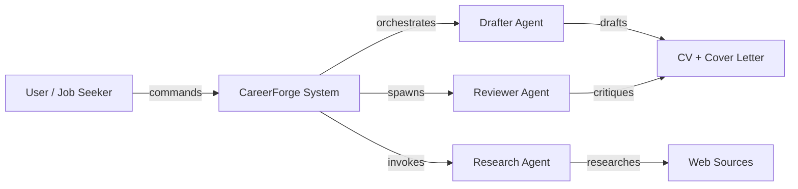

# Personas & Actors

> **Purpose:** Defines the personas and actors that interact with CareerForge, their goals, permissions, and key tasks.
>
> **Status:** Draft
> **Last updated:** 2026-06-05
> **Owner persona:** Business Analyst

---

## Actor Overview

CareerForge has one human actor and three AI agent actors. The human user drives all workflows; AI agents execute under the user's direction and always require human approval before taking consequential actions.

---

## Persona 1: The User (Job Seeker)

### Demographics
- **Role:** Technical professional (engineer, data scientist, researcher, consultant)
- **Experience:** 2–15+ years of professional experience
- **Technical comfort:** Proficient with CLI tools, version control, and text editors
- **Job search mode:** Active (applying regularly) or passive (monitoring market)

### Goals
1. **Produce high-quality, tailored applications efficiently** — Minimize time per application while maximizing relevance and professionalism
2. **Make informed apply/skip decisions** — Know whether a role is worth pursuing before investing effort
3. **Maintain a comprehensive professional record** — A single source of truth that grows over time
4. **Identify and close skill gaps** — Understand what to learn and in what order to reach target roles
5. **Prepare for interviews with real examples** — Have structured answers ready, drawn from actual experience

### Permissions
- Full read/write access to all profile files and generated documents
- Approval authority over all generated content (nothing is submitted without review)
- Can trigger any command, skip any step, and override any recommendation
- Controls which source documents are shared during onboarding
- Decides which reviewer suggestions to accept or reject

### Key Tasks
| Task | Trigger | Frequency |
|------|---------|-----------|
| Set up profile | First use or after reset | Once (then incremental updates) |
| Search for jobs | Periodic or on-demand | Weekly to daily |
| Apply to a job | Per posting | Per application |
| Expand competencies | After adding new documents or links | Occasionally |
| Analyze skill gaps | After tracking several applications | Periodically |
| Prepare for interview | Before each interview | Per interview |
| Reset profile | Starting fresh | Rare |
| Review pipeline / update application status / append manual applications | Via `/dashboard` | Weekly–daily during active search |

### Frustrations (Jobs to Be Done)
- "I spend hours tailoring each application and still miss keywords"
- "My CV looks fine in the editor but breaks when compiled to PDF"
- "I don't know if I should even apply to this role"
- "My skills are scattered across 10 different documents"
- "I keep getting rejected for the same types of roles but don't know what I'm missing"

---

## Persona 2: Drafter Agent

### Role
The primary AI agent that executes most CareerForge workflows. Acts as a career advisor, document generator, and quality controller.

### Capabilities
- Parse job postings from URLs or pasted text
- Evaluate job-candidate fit using the structured scoring framework
- Generate tailored LaTeX CVs and cover letters from profile data
- Compile LaTeX to PDF and visually inspect rendered output
- Apply reviewer feedback through targeted edits
- Run verification checklists
- Look up salary data via CLI tools
- Execute web searches for company research

### Constraints
- **Never fabricates** skills, experience, or achievements
- **Never submits** applications — only prepares materials for user review
- **Always verifies** company-specific claims via independent web search
- **Always compiles** PDFs and inspects them — never presents unverified LaTeX
- Must pass the **interview backtrack test** for every claim
- Token-efficient: does not re-read files already in context

### Interaction Model
- Receives commands from the user (setup, apply, scrape, expand, upskill, reset)
- Presents intermediate results (fit evaluation) and asks for user approval before proceeding
- Reports final output with a structured verification checklist

---

## Persona 3: Reviewer Agent

### Role
A second AI agent spawned with a fresh context to provide independent critique of application drafts. Operates as a "hiring manager proxy."

### Capabilities
- Research target companies via web search (website, news, culture, strategic initiatives)
- Read candidate profile and behavioral assessment for grounded critique
- Analyze CV and cover letter drafts for targeting quality, missed keywords, and tone
- Produce structured feedback in two formats:
  - **Part A:** Machine-applicable edits (exact string replacements with rationale)
  - **Part B:** Narrative suggestions for judgment calls

### Constraints
- **Fresh context** — Cannot access the drafter's working memory; receives drafts inline
- **Content critique only** — Does not verify LaTeX structure or run compilation
- **Does not run verification** — That is the drafter's responsibility in the final step
- **Limited file reads** — Reads only 4 profile files (candidate, behavioral, writing style, evaluation); does not read template files
- **Grounded in profile** — All suggestions must be based on actual profile data; never suggests fabrication

### Interaction Model
- Spawned by the drafter agent during Step 3 of the application pipeline
- Receives drafts inline in the prompt (token-efficient)
- Returns a single structured message with Part A + Part B feedback
- Does not interact directly with the user

---

## Persona 4: Research Agent

### Role
An optional, configurable agent that can be invoked for deeper research tasks requiring synthesis from multiple web sources. Defined at `.claude/agents/<name>.md` per ARCH-0009; the `model:` frontmatter field selects which LLM runs the agent (REQ-6001, DEC-015).

### Configuration
- Default model is Claude (no `model:` line, or `model: sonnet|opus|haiku`)
- Alternative model is Gemini via headless CLI (`model: gemini`); other LLM CLIs may be added by extending the runtime
- If the configured model's CLI is unavailable, falls back to Claude with a one-line warning (NFR-0009)

### Capabilities
- Execute targeted research queries
- Synthesize findings from multiple sources
- Provide structured summaries with source attribution
- Cross-reference facts for reliability

### Constraints
- Used opportunistically, not as part of the core workflow
- Results must be independently verified before inclusion in application materials
- No direct file-writing permissions

### Interaction Model
- Invoked by the drafter or directly by the user
- Returns research findings as structured text

---

## Actor Interaction Matrix

| Action | User | Drafter | Reviewer | Research |
|--------|------|---------|----------|----------|
| Trigger commands | ✅ | — | — | — |
| Approve/reject generated content | ✅ | — | — | — |
| Read profile files | ✅ | ✅ | ✅ (subset) | — |
| Write profile files | ✅ | ✅ (with user approval) | — | — |
| Generate CV/cover letter | — | ✅ | — | — |
| Critique drafts | — | — | ✅ | — |
| Compile LaTeX to PDF | — | ✅ | — | — |
| Search the web | ✅ | ✅ | ✅ | ✅ |
| Modify application tracker | — | ✅ | — | — |
| Reset profile data | ✅ (explicit confirmation required) | ✅ (executes) | — | — |
| Use tracking dashboard | ✅ | — | — | — |
