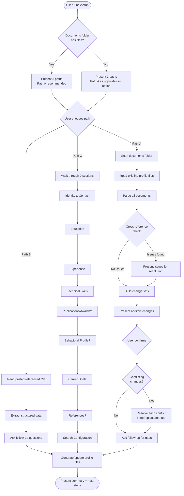
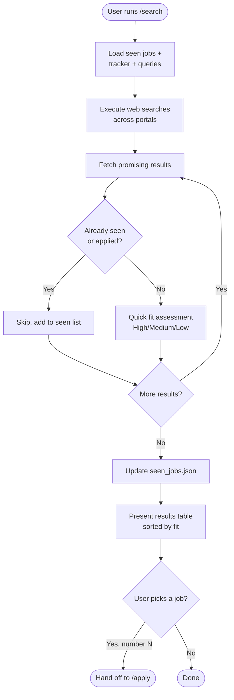
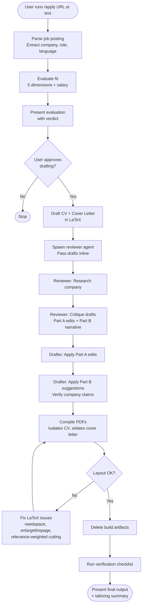
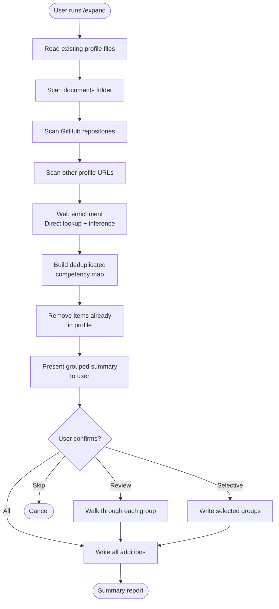
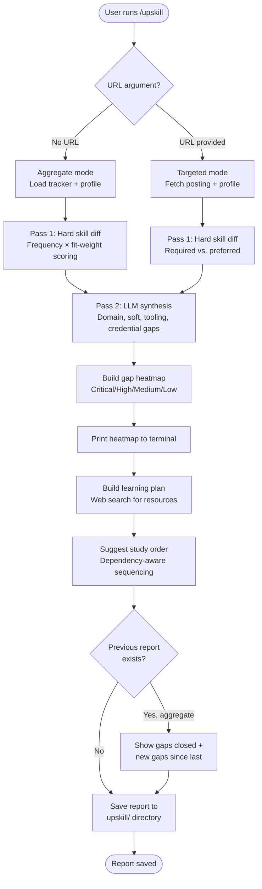
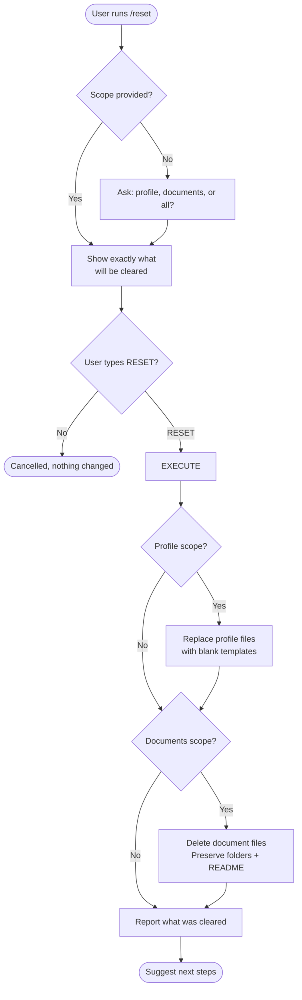
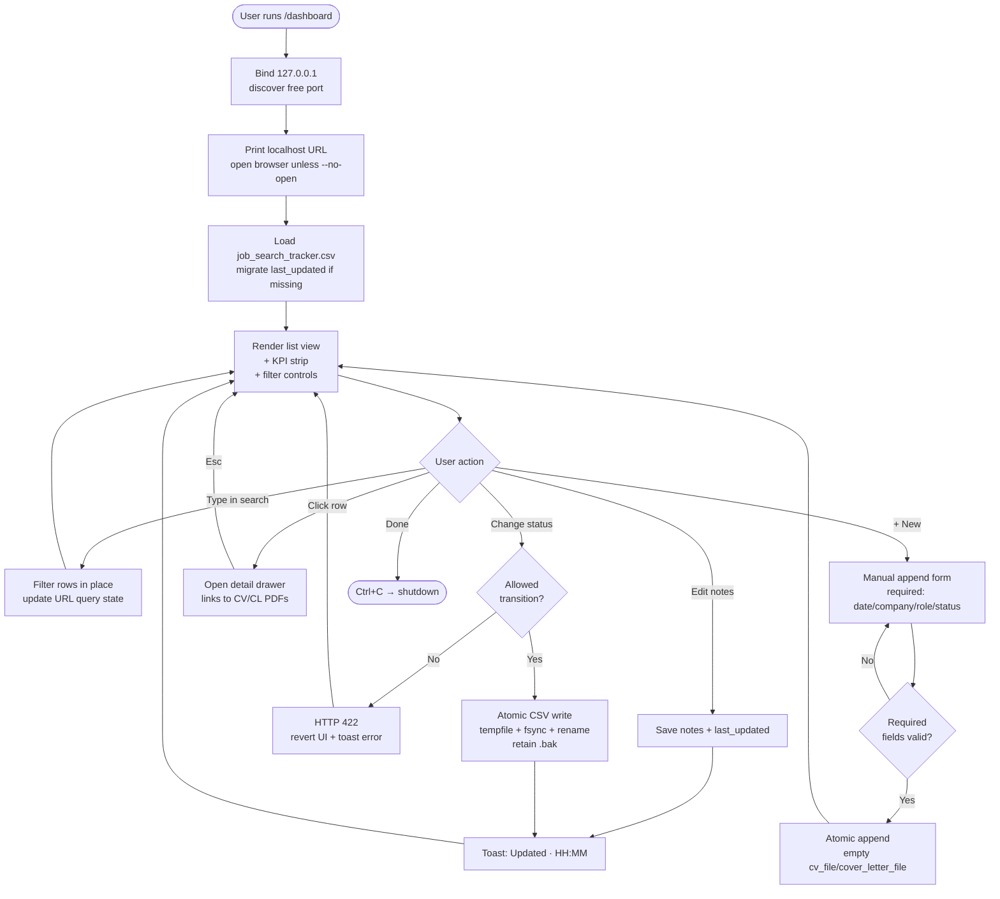

# User Flows

> **Purpose:** Documents end-to-end user journeys through CareerForge workflows with step-by-step descriptions and Mermaid flowcharts.
>
> **Status:** Draft
> **Last updated:** 2026-06-05
> **Owner persona:** Business Analyst

---

## 1. Setup Flow (Onboarding)

The user sets up their professional profile for the first time.



---

## 2. Job Search Flow

The user searches for matching job postings.



---

## 3. Application Flow (Drafter-Reviewer Pipeline)

The core value workflow for producing tailored applications.



---

## 4. Competency Expansion Flow

The user enriches their profile from additional sources.



---

## 5. Skill Gap Analysis Flow

The user analyzes gaps between their profile and target roles.



---

## 6. Reset Flow

The user clears profile data to start fresh.



---

## 7. First-Time User Journey (Happy Path)

End-to-end from first use to first application submitted.

```mermaid
flowchart LR
    FORK[Fork repo] --> INSTALL[Install dependencies]
    INSTALL --> SETUP[/setup<br/>Choose Path A, B, or C]
    SETUP --> EXPAND[/expand<br/>Enrich from GitHub etc.]
    EXPAND --> SEARCH[/search<br/>Find matching jobs]
    SEARCH --> PICK[Pick high-fit match]
    PICK --> APPLY[/apply<br/>Full pipeline runs]
    APPLY --> REVIEW[Review CV + cover letter PDFs]
    REVIEW --> SUBMIT[Submit application manually]
    SUBMIT --> TRACK[Update status in /dashboard]
    TRACK --> UPSKILL[/upskill<br/>Analyze gaps periodically]
```

---

## 8. Tracking Dashboard Flow

The user reviews their pipeline and updates application status after submitting or hearing back.



**Key behaviors:**
- Read-only mode (`--read-only`) disables all mutating controls; reaching a `PATCH` or `POST` route returns HTTP 403.
- Concurrent `/apply` appends compose safely with dashboard edits via the atomic rename contract (NFR-0016).
- Closing the terminal stops the server — no daemon, no persistent state outside the CSV.
