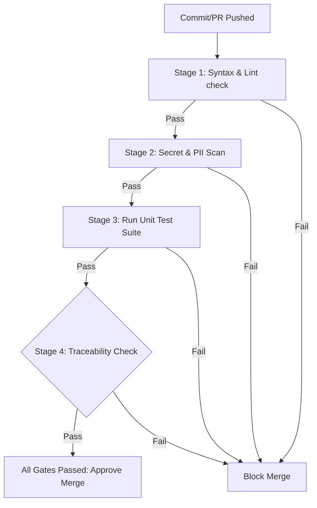

# Testing — CI Quality Gates

> **Purpose:** Configures automated integration checks and code validation policies applied to Pull Requests.
>
> **Status:** Draft
> **Last updated:** 2026-06-05
> **Owner persona:** QA Lead

---

## 1. Automated Integration Workflow

Every commit pushed to a branch or pull request triggers the GitHub Actions CI pipeline. The pull request cannot be merged unless all validation stages succeed.

---

## 2. Gate Verification Details

### Gate 1: Syntax & Lint Verification
- **Checks**:
  - Run `npm run lint` to catch ESLint errors or formatting deviations in TypeScript files.
  - Run `python -m black --check tools/` to confirm PEP-8 compliance.
- **Fail Rule**: Any formatting, warning, or compile error blocks the gate.

### Gate 2: Secret & PII Leak Scanner
- **Checks**:
  - Scan modified files against regex lists to detect AWS keys, OpenAI/Anthropic API keys, or custom tokens.
  - Scan directory commits to ensure no files are committed inside `settings/` (other than standard templates) or `cv/output/`.
  - Validate that the `.gitignore` has not been altered to allow sensitive file uploads.
- **Fail Rule**: Finding any credential pattern or excluded paths halts execution immediately.

### Gate 3: Core Test Suite
- **Checks**:
  - Run `npm test` executing the Jest/Vitest suite.
  - Run `pytest` executing Python utility tests.
- **Fail Rule**: 100% pass rate is required. If any unit test fails, the runner exits with code `1`.

### Gate 4: Specification Traceability
- **Checks**:
  - Validate that the pull request description or commit message contains at least one references to `REQ-####` or `ARCH-####`.
  - Validate that `docs/plan/work-breakdown-structure.md` is updated if new tasks are introduced.
- **Fail Rule**: If no traceability tags are found, a comment is posted and the merge is blocked.
